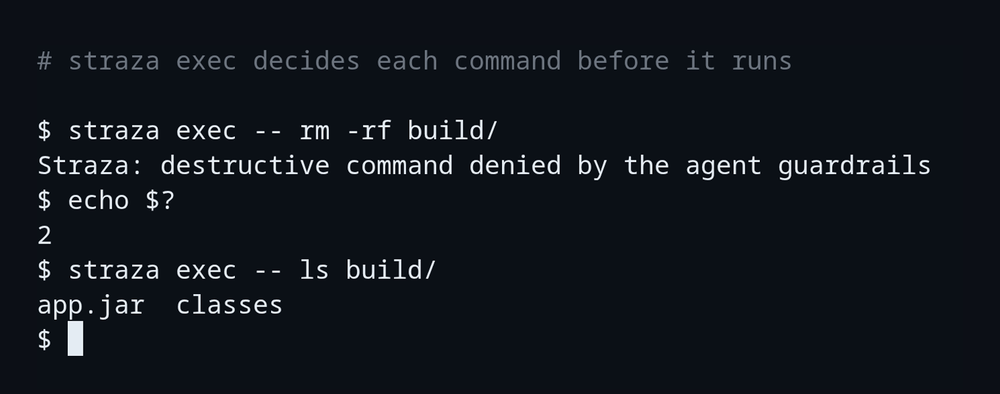

<h1 align="center">
  <picture>
    <source media="(prefers-color-scheme: dark)" srcset="website/static/readme/straza-logo-dark.svg">
    
  </picture>
</h1>

<p align="center">
  <strong>Open source runtime governance for AI agents.</strong><br>
  A service you operate, not a library inside the agent.
</p>

<p align="center">
  <a href="https://github.com/strazahq/straza/actions/workflows/ci.yml"></a>
  <a href="https://github.com/strazahq/straza/releases"></a>
  <a href="#license"></a>
</p>

<p align="center">
  <a href="https://docs.straza.ai/">Docs</a> ·
  <a href="#quickstart">Quickstart</a> ·
  <a href="#run-the-whole-stack-on-one-machine">Demo stack</a> ·
  <a href="spec/policyset/SPEC.md">Policy reference</a> ·
  <a href="https://docs.straza.ai/guides/approve/phone/">Approver app</a> ·
  <a href="SECURITY.md">Security</a>
</p>

<p align="center">
  <strong>Straza is under heavy development.</strong> Expect frequent releases and changes between
  them, and read the release notes before you upgrade.
</p>

<p align="center">
  <picture>
    <source media="(prefers-color-scheme: dark)" srcset="website/static/readme/held-call-dark.svg">
    
  </picture>
</p>

<p align="center"><em>A replay of one MCP call on the
<a href="#run-the-whole-stack-on-one-machine">enterprise demo stack</a>, drawn with the strings of
a live run. A <code>mode: approve</code> rule makes it wait, the agent's sponsor approves it on
the Straza approver app, and then it runs.</em></p>

**Your IdM decides who. Straza enforces what their agents may do, at every action.**

Straza is the control plane between your IdM/IGA and your agents. People, AI agents and their
roles come in from your identity manager over SCIM 2.0. Each shell command, file write, network
fetch and MCP tool call that reaches a Straza hook, the MCP gateway or `straza exec` is decided
against signed policy before it runs. The action is allowed, denied with a reason the model can
read, or it needs approval from a person, and every decision is appended to a hash chain you can
verify.

Straza governs what agents do, not what models say. It never proxies model traffic, and no AI
runs inside it: every decision is deterministic policy evaluation.

## Quickstart

Get `strazad`, `straza` and `strazactl` from the
[releases page](https://github.com/strazahq/straza/releases), or build all three with
`make build` from a checkout. [Deployment](#deployment) says how to verify a release first.

### Sixty seconds on one machine

Start the server in the standalone profile in an empty directory:

```sh
strazad serve --profile standalone
```

The first boot prints the passwords of the `admin` and `break-glass` accounts once, so store
both. It also seeds a starter policy, and the log ends with a `strazad serving` line for
`127.0.0.1:8420`. In a second terminal, sign in:

```sh
strazactl login --server http://127.0.0.1:8420
```

The command prints an address and a code. Open the address in a browser, sign in as `admin`,
and the terminal prints `Logged in as admin.` Now ask the server what it would decide for a
destructive command:

```sh
strazactl policy simulate --roles dev --tool shell.exec --command 'rm -rf /tmp/x'
```

```text
This call would be denied.
Decided by rule block-recursive-delete in policy standalone-starter: Straza starter policy: recursive force-delete is denied. Delete files individually, or an admin can edit the standalone-starter PolicySet.
```

The full output goes on to name the subject, the snapshot and the wire fields.

### Your first governed agent

Enroll this machine, which prints an address and a code the same way the login did:

```sh
straza enroll --server http://127.0.0.1:8420
```

The terminal ends with `Enrolled as admin` and the device id. Claude Code sends its hook one
payload when a session starts and one before each tool call. Send the first, and `straza`
checks in and answers with the governance banner:

```sh
printf %s '{"hook_event_name":"SessionStart","session_id":"5f0c9a1e-7b2d-4e8a-9c3f-2d1b0a9e8f71","cwd":"/work","source":"startup"}' | straza hook --harness claude-code
```

Then send what the agent's tool call looks like when it tries the same command:

```sh
printf %s '{"hook_event_name":"PreToolUse","session_id":"5f0c9a1e-7b2d-4e8a-9c3f-2d1b0a9e8f71","cwd":"/work","tool_name":"Bash","tool_input":{"command":"rm -rf /tmp/x"}}' | straza hook --harness claude-code
```

```text
{"hookSpecificOutput":{"hookEventName":"PreToolUse","permissionDecision":"deny","permissionDecisionReason":"Straza starter policy: recursive force-delete is denied. Delete files individually, or an admin can edit the standalone-starter PolicySet."}}
Straza starter policy: recursive force-delete is denied. Delete files individually, or an admin can edit the standalone-starter PolicySet.
```

The first line is the answer Claude Code reads, the second goes to stderr, and the command exits
with status 2. Wire the hook into Claude Code for real with `straza install claude-code`, and
`codex` or `gemini` work the same way after the trust step each guide names.
[Your first governed session](https://docs.straza.ai/get-started/first-governed-session/) walks
through it in a live agent.

## Run the whole stack on one machine

The enterprise demo stack runs a whole deployment on one machine: midPoint as the identity
manager, Keycloak as the identity provider, strazad with its console and MCP gateway, the
demo-tools, midPoint and MCP Apps example servers, and an autonomous AI agent, with
identities, roles and approval rules already seeded. Every agent is born in midPoint and
reaches Straza over SCIM with no manual step. It needs Docker with Compose, it was tested on
8 GB of memory and four processors, and the first boot builds from source in 10 to 20
minutes.

```sh
git clone https://github.com/strazahq/straza.git && cd straza
deploy/compose/eval-stack/up.sh
docker compose -f deploy/compose/eval-stack/compose.yaml logs -f eval-seed
```

```text
[seed] Landing page: http://localhost:8400  <- start here
[seed] Console:  http://localhost:8420/console/   (alice / alice)
```

`up.sh` publishes the ports on every interface with public lab passwords, so a phone on your
network can pair with it, and it belongs on a trusted network only. The midPoint MCP server runs
from its released image, pinned by digest, so it needs no checkout.

| What | Address | What to do there |
|---|---|---|
| Landing page | <http://localhost:8400> | Every service, address and login with copy buttons, a ten-minute demo, and the docs |
| Console | <http://localhost:8420/console/> | Sign in as `alice` / `alice` through Keycloak, then look at policy, MCP servers, approvals and the audit chain |
| midPoint | <http://localhost:8087/midpoint> | The identity manager where every person and agent is born |
| Keycloak | <http://localhost:8480> | The identity provider every sign-in goes through |
| Kibana, with the SIEM overlay | <http://127.0.0.1:5601> | The audit records as they arrive, in the `straza-events` data view |

Once the seeder prints its ready banner, try three things:

1. Decide an agent's request. `docker exec straza-sam sh /opt/sam/raise-ticket.sh` makes the
   autonomous agent try a gated deploy, which comes back denied with a ticket that its sponsor
   alice or a security approver decides. Decide it as alice in the console under Approvals, or on
   your phone once you pair it under Approvals, then Approver devices. Run the script again, and
   the deploy uses the grant once.
2. Pull the kill switch. Disable `sam-sre-agent` in midPoint under Users. Within seconds its
   sessions are revoked. Its next governed heartbeat, due up to 10 minutes later, is refused, and
   `docker compose -f deploy/compose/eval-stack/compose.yaml ps agent-sam` then shows it unhealthy.
3. Watch the agent at work. `docker compose -f deploy/compose/eval-stack/compose.yaml logs agent-sam`
   shows its governed start, with an MCP call allowed through the gateway and a destructive
   command denied with its reason.

To see the audit stream in a SIEM, start the stack with the SIEM overlay instead. It adds
Elasticsearch and Kibana, needs 1.5 to 2 GB more memory, and binds every port to the loopback
address, so pair a phone on the `up.sh` shape:

```sh
cd deploy/compose/eval-stack
docker compose -f compose.yaml -f compose.loopback.yaml -f compose.siem.yaml up -d --build
```

[The demo stack](https://docs.straza.ai/get-started/enterprise-demo-stack/) walks
through the identities, the roles and the kill switch, then covers the overlays and
[the hardened shape](https://docs.straza.ai/get-started/enterprise-demo-stack/#demo-defaults-and-the-hardened-shape).

## How it works

<p align="center">
  <picture>
    <source media="(prefers-color-scheme: dark)" srcset="website/static/readme/architecture-dark.svg">
    
  </picture>
</p>

1. An agent acts. A harness hook, `straza exec` or the Python kit hands the action to `straza`
   on the same machine, and an MCP client calls the strazad gateway at `/mcp`.
2. `straza` decides against the signed snapshot it verified, with no network call in the
   common case. The gateway decides on the server, and no database read sits on either path.
3. The action is allowed, denied with the operator's reason, or it waits for a decision while
   Straza sends the request to the approver's phone, the console, Slack or the CLI.
4. An allowed MCP call runs with its upstream credential injected at the gateway, so the agent
   never holds it.
5. Every decision is appended to a SHA-256 hash chain, and sinks stream the records to your
   SIEM.

## What Straza does

### A decision at every action

The hooks of Claude Code, Codex CLI and Gemini CLI send each shell command, file read and write,
network fetch and subagent spawn to `straza`, which decides it against the signed snapshot on
the machine. A deny carries the operator's reason, so the model can tell its user why and try
something else. A process with no hook surface runs under `straza exec`, which decides its argv
the same way.

<p align="center">
  
</p>

A rule with `mode: classify` adds a heuristic check for interpreter indirection, such as a
download piped into a shell or a decoded payload run by an interpreter, and denies with the
signal it found:

```text
Straza: classifier: nested-eval: pipe-to-shell: "curl -s https://get.example.com/install.sh | sh"
```

The classifier is a fixed set of rules with no model, no network and no state, and it is off
unless a policy set asks for it.

### Human approval, signed on the phone

A `mode: approve` rule makes a call need a person's decision. At the gateway the call stays open
for up to 120 seconds by default and then answers that the approval is pending, and a hook
answers deny with a retry allowance that the approval then lets through. The rule names its
deciders: holders of an approver role, the agent's sponsor, or both, and a rule that names nobody
goes to the person behind the agent. Role membership is checked when the decision arrives, and a
call nobody decides before its deadline is denied, after 90 seconds unless the rule sets another.

<p align="center">
  <picture>
    <source media="(prefers-color-scheme: dark)" srcset="website/static/readme/approval-flow-dark.svg">
    
  </picture>
</p>

When push delivery is set up, Straza sends the request to the approver's phone as a push
notification. The [Straza approver app](https://docs.straza.ai/guides/approve/phone/), in the
[App Store](https://apps.apple.com/app/straza-approver/id6798735074) and on
[Google Play](https://play.google.com/store/apps/details?id=ai.straza.approver), shows a redacted
preview of the call, the rule and the agent's stated reason marked as unverified, and the
approval binds the exact arguments. The app signs each decision with a key it generated in the
phone's secure hardware, and strazad verifies every signature. A decision can also come from the
console, from Slack or from `strazactl approvals approve`, and `strazactl approvers revoke` cuts a
lost phone off at its next call.

### A default-deny MCP gateway

strazad fronts every registered MCP server as one `/mcp` endpoint, and an agent sees only the
tools its application roles have access to. A tool without access does not exist for the role:
it is missing from the tool list and unknown when called.

<p align="center">
  <picture>
    <source media="(prefers-color-scheme: dark)" srcset="website/static/readme/default-deny-dark.svg">
    
  </picture>
</p>

An application role belongs to the one server it reaches, so it is created on that server
together with its tools, in one call. The demo stack's seeder made demo-tools-readers this way:

```sh
strazactl roles create demo-tools-readers --app demo-tools \
  --tools echo,get-annotated-message,get-env,get-sum
```

`strazactl catalog preview --user <name>` or `--role <name>` shows what any agent or role would
see, with a status and a reason for every tool or server.

### Credentials stay at the gateway

strazad keeps upstream secrets sealed at rest and puts them, or a person's OAuth grant, into the
upstream call on the server. The agent's machine and the model's context never receive them,
and the secret list shows fingerprints, never values. A `command` or `oci` MCP server that
strazad runs as a process never carries a caller's own credential.

### Tamper-evident audit

Every decision is appended to a chain in which each record's hash covers the previous record's
hash and the record's own CloudEvent. `strazactl audit verify` recomputes the whole chain on your
machine and names the first record that does not match.

<p align="center">
  <picture>
    <source media="(prefers-color-scheme: dark)" srcset="website/static/readme/audit-chain-dark.svg">
    
  </picture>
</p>

Sinks stream the records to a SIEM by webhook, signed with HMAC-SHA256 when you set a key, or to
a file. Conversation recording is opt-in per policy set, word for word or with secrets masked,
and the chain holds each turn's hash and size.

### Identity from your identity manager

People, AI agents and roles come from your identity manager over SCIM 2.0, and people sign in
through your identity provider over OIDC, or through strazad's built-in sign-in page. midPoint is
the reference identity manager and runs in the demo stack. An AI agent's sponsor is the person
accountable for it.

Deactivating a user in the identity manager is the kill switch: it revokes every session of that
user. A machine whose daemon holds the push lane learned of it in under two seconds on the demo
stack, and one without the daemon learns of it within the session token's lifetime of 300
seconds.

### Fail-closed

When `straza` needs the server for a decision, such as an approval, and cannot reach it, it
denies within 2 seconds with a reason that says the security layer is unreachable. A client
decides from its verified snapshot while its session token is valid, at most 300 seconds after it
was minted, and renews the token as it goes. When the renewal cannot reach strazad, the grace
period adds nothing in the enterprise profile and 15 minutes in the standalone profile, and past
it every governed action is denied. A snapshot that fails signature verification is never
enforced: the client keeps the last verified one until its session time runs out, then denies.

## A policy set

This is the start of the policy set the hero above runs under, one of the demo stack's seeded
policies
([`demo-tools-sandbox-access.yaml`](deploy/compose/eval-stack/seed/policies/demo-tools-sandbox-access.yaml)).
The set goes on with a second rule that turns `get-env` into a day-scale ticket.

```yaml
apiVersion: straza.dev/v1beta1
kind: PolicySet
metadata:
  name: demo-tools-sandbox-access
  description: Gates for the role demo-tools-sandbox, written from the role page
spec:
  priority: 100
  match:
    roles: [demo-tools-sandbox]
  rules:
    - id: demo-tools-get-sum-approve
      # binding call: the approval covers these exact arguments, so a
      # changed sum is a new hold and a retry of the same one runs.
      tools: [mcp.call]
      apps: [demo-tools]
      toolNames:
        allow: ["get-sum"]
      effect: allow
      mode: approve
      approve:
        deciders: [sponsor]
        timeoutSeconds: 120
        retryTTLSeconds: 120
        binding: call
      reason: "Straza: get-sum needs approval, the 2-minute MCP showcase (the person behind this agent decides, on their phone or on /self-service/)"
```

- `match.roles` applies the set to agents that hold the application role `demo-tools-sandbox`.
- The rule catches one MCP tool, `get-sum` on the `demo-tools` server, and `mode: approve` makes
  each call wait for a decision.
- `deciders: [sponsor]` sends it to the agent's sponsor, who has 120 seconds. With
  `binding: call` the approval covers these exact arguments, and a retry of the same call within
  `retryTTLSeconds` runs.
- `reason` is the sentence the audit record keeps for this rule's decisions. For a deny rule,
  like the one below, it is also the sentence the agent reads.

A deny rule is shorter. This one is from the demo stack's hook-lane guardrails
([`agent-guardrails.yaml`](deploy/compose/eval-stack/seed/policies/agent-guardrails.yaml)):

```yaml
    - id: no-rm-rf
      events: [tool.pre]
      tools: [shell.exec]
      command:
        denyPatterns: ["rm -rf *", "git push --force*", "curl * | *sh*"]
      effect: deny
      reason: "Straza: destructive command denied by the agent guardrails"
```

A deny wins across every matching set, and priority only picks which rule is reported. The
[policy set specification](spec/policyset/SPEC.md) defines every field, and
`strazactl policy simulate` answers what the live policy would decide.

## Integrations

| Area | Integration | Status | Guide |
|---|---|---|---|
| Agent | Claude Code, Codex CLI, Gemini CLI, through their hooks | Supported | [Claude Code](https://docs.straza.ai/guides/govern-an-agent/claude-code/), [Codex CLI](https://docs.straza.ai/guides/govern-an-agent/codex-cli/), [Gemini CLI](https://docs.straza.ai/guides/govern-an-agent/gemini-cli/) |
| Agent | Python agents through the standard-library agent kit, with glue for LangChain, the OpenAI Agents SDK and the Claude Agent SDK | Supported | [Python agents](https://docs.straza.ai/guides/govern-an-agent/python-agents/) |
| Agent | CrewAI, Google ADK and Pydantic AI through the same kit | Supported, wired by hand | [Python agents](https://docs.straza.ai/guides/govern-an-agent/python-agents/) |
| Agent | A process with no hook surface, through `straza exec` and the sandbox image | Supported | [Hookless processes](https://docs.straza.ai/guides/govern-an-agent/hookless-processes/) |
| Agent | Headless CI and fleet agents, enrolled with an Ed25519 key | Supported | [Headless agents](https://docs.straza.ai/guides/govern-an-agent/headless-agents/) |
| Agent | Cursor | Planned | [Roadmap](https://docs.straza.ai/project/roadmap/) |
| MCP | Any MCP client, through the gateway at `/mcp`, to remote servers and to servers that strazad runs as processes | Supported | [Any MCP client](https://docs.straza.ai/guides/govern-an-agent/any-mcp-client/) |
| Identity | midPoint over SCIM 2.0, the reference identity manager | Supported, runs in the demo stack | [midPoint](https://docs.straza.ai/guides/connect-identity/midpoint/) |
| Identity | Any SCIM 2.0 identity manager | Supported | [Generic SCIM](https://docs.straza.ai/guides/connect-identity/generic-scim/) |
| Identity | Okta | Supported, the guide's SCIM requests were replayed, not yet run against an Okta tenant | [Okta](https://docs.straza.ai/guides/connect-identity/okta/) |
| Identity | An OIDC identity provider, Keycloak in the demo stack, or strazad's built-in sign-in | Supported | [Keycloak login](https://docs.straza.ai/guides/connect-identity/keycloak-login/) |
| Approval | Straza approver app for iOS and Android | Supported, F-Droid planned | [Phone](https://docs.straza.ai/guides/approve/phone/) |
| Approval | Console, the self-service page and `strazactl` | Supported | [Console](https://docs.straza.ai/guides/approve/console/) |
| Approval | Slack | Supported, not yet run against a live Slack workspace | [Slack](https://docs.straza.ai/guides/approve/slack/) |
| Approval | Microsoft Teams | Planned | [Roadmap](https://docs.straza.ai/project/roadmap/) |
| SIEM | Webhook sink with an optional HMAC-SHA256 signature, and file sink | Supported | [Sinks and SIEM](https://docs.straza.ai/guides/audit/sinks-and-siem/) |

## Deployment

The server is one static binary. On a laptop it runs on its embedded SQLite database and event
broker, and the same binary runs on Postgres and NATS across a Kubernetes cluster. No decision
leaves your infrastructure.

- Release archives for Linux, macOS and Windows on amd64 and arm64 are on the
  [releases page](https://github.com/strazahq/straza/releases), each with an SBOM.
- The container image `ghcr.io/strazahq/straza` is multi-arch and signed by digest.
- On Kubernetes, `helm install straza deploy/helm/straza` installs the chart in this repository,
  which bundles Postgres and NATS by default and lets you bring your own.
- From source, Go 1.26 or newer and `make build` put the three binaries under `bin`.

`checksums.txt` on each release is signed by keyless cosign from the GitHub Actions job that
built it. Verify it before you extract:

```sh
cosign verify-blob --signature checksums.txt.sig --certificate checksums.txt.pem \
  --certificate-identity-regexp '^https://github\.com/Strazahq/straza/\.github/workflows/release\.yml@refs/tags/v[0-9]+\.[0-9]+\.[0-9]+$' \
  --certificate-oidc-issuer https://token.actions.githubusercontent.com checksums.txt
sha256sum -c checksums.txt --ignore-missing
```

The identity pattern pins the signing certificate to this repository, its release workflow and a
version tag, so a signature made anywhere else does not verify. The
[install guide](https://docs.straza.ai/get-started/install/) and
[Run it on Kubernetes](https://docs.straza.ai/get-started/run-it-on-kubernetes/) cover the rest.

## Security model

Straza checks the actions that pass through its hooks, its MCP gateway and `straza exec`, and
each lane holds differently:

- A hook installed in user mode on an open machine is advisory, because an agent that can run
  anything can skip it. `sudo straza install --managed --server <server-url> claude-code` writes a
  root-owned layout the user cannot edit, and the server checks the measured wiring at check-in.
- The MCP gateway holds at a boundary, because the decision, the catalog and the credential all
  live on the server. It sees only what goes through MCP.
- `straza exec` inside the sandbox image is the only way the agent's process can run anything,
  except the agent's own interpreter and the binaries on the image's allowlist, the residuals the
  trust model names. On an open machine it is as advisory as a user-mode hook.

Clients verify policy snapshots against keys pinned at enrollment, session tokens are
Ed25519-signed, upstream credentials never reach the agent, and anyone allowed to read the audit
records can recompute the chain.

Straza does not govern what a model thinks or writes, does not proxy model traffic, does not
protect an endpoint from its own root, and does not replace your identity manager. It is not a
compliance certificate either. [docs/compliance.md](docs/compliance.md) maps its controls to
ISO/IEC 27001 Annex A and NIS2 Article 21(2), and whether that meets a regulation is your
assessment. The [security model](https://docs.straza.ai/security/security-model/) lists the
invariants, what each costs and the known limits, and the
[trust model](https://docs.straza.ai/concepts/trust-model-and-non-goals/) says what each lane is
worth.

Report a vulnerability through
[GitHub private vulnerability reporting](https://github.com/strazahq/straza/security/advisories/new)
or to [security@straza.ai](mailto:security@straza.ai), never in a public issue.
[SECURITY.md](SECURITY.md) has the response times, the scope and the supported versions.

## FAQ

The [FAQ on the docs site](https://docs.straza.ai/project/faq/) gives the same answers, each with
a link to the page that covers its topic.

<details>
<summary>Is there AI inside Straza?</summary>

No. Every decision is deterministic policy evaluation over a signed snapshot. The optional
classifier is a fixed heuristic with no model, no network and no state, and the audit sentinel
is rule-based detection that runs after the fact and blocks nothing.

</details>

<details>
<summary>What happens if strazad is down?</summary>

In the enterprise profile, governed actions are denied once the cached session token expires,
at most five minutes after it was minted, because the grace period is zero. The standalone
profile adds 15 minutes of grace. A decision that needs the server, such as an approval, is
denied within 2 seconds with a reason that says the security layer is unreachable. Nothing fails
open.

</details>

<details>
<summary>How does Straza relate to my identity manager?</summary>

Your identity manager stays the source of who exists, which roles they hold and who sponsors
each AI agent. Straza reads that over SCIM 2.0 and turns it into decisions at every action. A
role assignment reaches a running agent at its next check-in, and a deactivation revokes the
user's sessions.

</details>

<details>
<summary>Does Straza filter prompts or model outputs?</summary>

No. Straza decides what an agent does, the tool calls and commands, and never sits on the model's
wire. When a policy set turns on recording, the conversation is recorded for audit, word for word
or with secrets masked, and the model's traffic is never filtered or rewritten.

</details>

<details>
<summary>Does any data leave my infrastructure?</summary>

Decisions happen on the agent's machine or on your strazad. What leaves is what your configuration turns on. A
Slack approval card carries the requester, the action and the redacted call preview to Slack. A
phone push travels through Apple's or Google's push service, or through the Straza relay at
push.straza.ai, as an envelope with no content. The relay is off for strazad on its own and on in
the Helm chart, the compose template and the demo stack, and `pushRelay.enabled: false` or
`STRAZA_APPROVAL_PUSH_RELAY_ENABLED=false` turns it off.

</details>

## Status

v1.1.0 is the first public release, and the project is under heavy development, so expect
frequent changes between releases. It carries the three enforcement lanes, human approval in
the console, in Slack and on the phone, headless enrollment, conversation recording and the
audit sentinel. Microsoft Teams, a Cursor adapter and passkeys for the built-in sign-in come
next, and the [roadmap](https://docs.straza.ai/project/roadmap/) says what follows.

## Contributing

Pull requests are welcome. Open an issue first for anything beyond a small fix, and accept the
[Contributor License Agreement](CLA.md) on your first pull request.
[CONTRIBUTING.md](CONTRIBUTING.md) has the steps and the gates every change passes, and
[SUPPORT.md](SUPPORT.md) says where to ask a question.

## License

The core is AGPL-3.0-only. The specifications, the agent kits, the public Go packages, the
adapters and plugins, and the mobile approver app are Apache-2.0, as the table below spells out.

| Part | License |
|---|---|
| `strazad`, `straza`, `strazactl`, the console, and everything else in this repository that the rows below do not name, including `cmd/`, `internal/`, `web/`, `deploy/`, `docs/`, `test/`, `tools/` and `website/` | [AGPL-3.0-only](LICENSE) |
| `spec/`, `kits/`, `pkg/`, `adapters/` and `plugins/`, the copy of the plugin skill and its catalog files that the docs site serves from `website/static/.well-known/`, `.claude-plugin/marketplace.json`, and the mobile approver app in its own repository | [Apache-2.0](LICENSE-APACHE) |
| Third-party source: the QR encoder `web/ui/src/vendor/qrcodegen.js` by Project Nayuki, and the 18 interface components in `web/ui/src/components/ui/` generated from shadcn/ui | MIT, with the notices in the files and in `web/ui/src/components/ui/LICENSE` |
| The prebuilt connector `deploy/compose/eval-stack/midpoint/connectors/universal-rest-connector.jar` for the evaluation stack, a separate program | Apache-2.0, its own license, with the license and notice files beside it |

Each part is licensed under the one license its row names, and no later version of the
AGPL applies. The licenses grant no right to use the Straza name or logo, and
[TRADEMARKS.md](TRADEMARKS.md) says how they may be used. [NOTICE](NOTICE) says where
the notices of the third-party software in the binaries, the image and the console
are. Running an unmodified copy inside your organization creates no obligation, and a
commercial license is available through [hello@straza.ai](mailto:hello@straza.ai).

Straza™ is a trademark of SynapTech s. r. o. Built in Slovakia.
