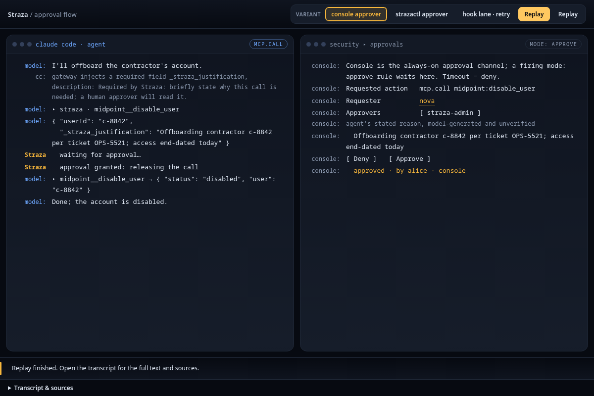
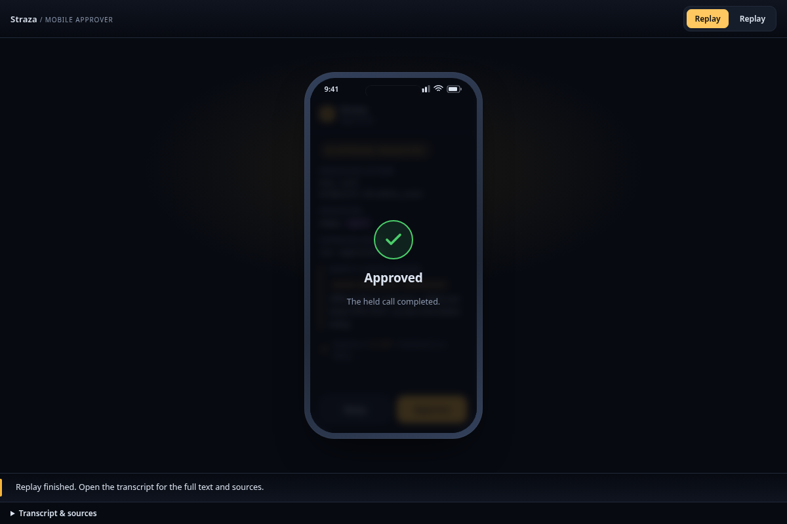

An approval rule makes a person decide before a tool runs. Straza opens a request and tells the people who may decide it, and they answer in the console, on the self-service page, in Slack or on an enrolled phone. A hold fits a decision a person makes within minutes, and a ticket one that takes hours or days. A refusal, a timeout or an unreachable approval service ends in a deny. AI agents and service accounts never decide.

Some actions are fine when a person meant them and dangerous when a model guessed, such as disabling an account, running a deploy or writing to production. A deny would stop the useful work, and an allow would leave the choice to the model.



What the agent meets depends on the rule's class and on where Straza checks the call:

| Class | MCP call at the gateway | Local tool call in a hook |
|---|---|---|
| Hold | Waits while a person decides, for a bounded time | Denied at once with a reference. The same call passes once after the approval. |
| Ticket | Denied at once with a reference for a decision that may take hours or days | Denied at once with a reference, as at the gateway |

## A hold on the gateway and in a hook

On the gateway, a hold keeps the MCP call open while the request is pending, for the rule's decision window, 90 seconds by default. The call goes on to the MCP server as soon as a person approves. A rule may set a window longer than the hold cap, 120 seconds by default. Then the gateway answers when the cap runs out, with the request's reference, the time left and where a person can decide, and an approval that comes later runs the call on the agent's retry.

In a hook, a hold never waits. Harnesses stop a hook on their own clock, so the first call is denied at once with a reference, and the reason tells the agent to send the exact same call again after the approval.

One approval runs one call. A call that is still held uses it when it wakes. A call that already answered pending can use it on a retry, within 60 seconds of the decision by default, and that retry passes with the approver's name in the reason. Every later call needs a new decision. [Lifetimes and timeouts]() lists every window and what happens when it runs out.

## What an approval covers

An approval binds what the person actually saw. For an MCP call it covers the tool and its exact arguments by default, so a retry with different arguments is a new request. A rule can loosen that to the tool alone, for a harmless tool whose arguments change on every call.

On the gateway, a held tool gains a required justification field, so the agent states in its own words why it needs the call, and the person reads that statement on the request. Straza records the justification as the agent's own unverified words. It strips the field from the arguments before they reach the audit record or the MCP server.

## Who may answer

A rule names its deciders. It can list approver roles, a role kind that carries the authority to decide and nothing else. It can add the person behind the agent, written `deciders: [sponsor]`, and a rule that names nobody goes there by default. For an agent, that person is its sponsor, the accountable person your identity manager records on it. A person who runs their own agent and has no sponsor decides alone, and a person who has a sponsor is decided by that sponsor.

When an agent's deciders come out empty, with no roles and no usable sponsor, the request is denied at once with the cause and the fix in the reason. A request nobody is told about could only expire.

At decision time the server reads the decider's current roles, so a role removed in the identity manager this morning cannot approve this afternoon. Requesters may not decide their own request unless the rule allows it, and an autonomous agent never may, whatever the rule says. An AI agent is refused on every surface, even when an approver role was assigned to it by mistake.

A confirm rule turns this around. Only the requester may confirm, because the record proves that the person behind the session was present and meant it, and nobody else can supply that. An autonomous session has no person behind it, so the engine turns a confirm rule into a plain deny for it at once. The agent runs as its person and can reach every credential on their machine. The confirmation therefore counts only when a phone or browser that the person enrolled signs it. By default the console and strazactl refuse a person's own request, and a session that a coding harness checked in decides nothing at all.

## Tickets for decisions that take a day

A ticket fits a decision that takes hours or days, such as a deploy that needs a change board or a read of a sensitive store. Tickets never block. The first call is denied with a ticket reference, and the person has 24 hours to decide by default. An approval turns the ticket into a grant. Any later session of the same requester can use the grant once, within an hour by default.

The grant is a stored row that the server uses up, so a client that is offline can never cash it. A ticket that a person denied stays denied for the rest of its window, and a retry inside that window is denied without asking the approvers again. Three built-in gateway tools let an agent request a ticket for a described call, read its state and wait for it. On purpose, no tool can decide a request.

## Channels

A person decides in one of these places:

- The console needs no setup. An admin sees the queue under **Approvals** and decides there, as [Approve in the console]() shows.
- On the self-service page, a person who is not an admin decides from a browser they enabled once, which signs each decision with a key it keeps. [Approve in the browser]() sets it up.
- Slack posts a card into a channel you configure and verifies the signature of every button press. The agent's justification is not forwarded there unless you turn that on, as [Slack]() shows.
- Phone approval sends the request to the approver's phone as a push notification that carries only an opaque reference. The Straza approver app, from the App Store or Google Play, fetches the request over its enrolled session and signs the decision with the phone's key. [Approve on a phone]() enrolls one.
- strazactl and the admin API decide too, whatever a rule's notification routing says.

The `approve.notify` list of a rule narrows which channels announce its requests. A request with no decider signal at all is announced nowhere, so an unconfigured rule cannot notify every admin across a fleet.

## Timeouts and the record

A sweep runs every 15 seconds and marks each pending request past its window as expired, which the agent sees as a deny. Every phase leaves a record on the audit chain. One record opens the request. A second resolves it as approved, denied or expired, with the decider, the channel they used and their own words. Each call that uses the approval, a ticket's grant or a hold's one run, adds one more record that names the session. Decided requests are kept for 30 days by default and then deleted.

## Why a held call answers early

Holding the gateway call open for the whole decision window fails when the client gives up first. The model then reads a network timeout, and in a live run it invented the tool's output. Straza therefore answers a held call when the hold cap runs out, 120 seconds by default, which is long enough for an approver to reach a phone. The answer is a structured text that the model respects.

If your clients give up sooner, such as the Python kit at 30 seconds or common MCP clients at 30 to 60 seconds, lower `approval.gatewayHoldSeconds` below their deadline. The cost is one more round trip for a slow approver, because the agent waits with the built-in await tool or retries after the person answers. A window shorter than the cap is unchanged, and the cap never extends a window.



When a person approves a hold within its window, the server stores one run of that call in the database, keyed by the session, the rule and the call's fingerprint. A held call that wakes, or a retry that matches, uses that run up.

Before it asks anyone, the gateway checks the call's arguments, without the justification, against the input schema the MCP server published. Arguments that break it, such as a missing required field or a value of the wrong type, go back to the agent as an error to fix, and no request is opened. A schema the check cannot read, or one that refers to a document outside itself, skips the check, and the call is held as before.

A waiting gateway call wakes on the broadcast that a request was resolved, or on its own timer. If a broadcast is missed, the wait only runs to the timer and denies.

A ticket's grant is a durable row that a server-side write consumes. The built-in tools that request a ticket, read its state and wait for it run on the gateway like any other tool, so policy decides whether an agent sees them.


Read next: [Evidence and audit]() explains the record every one of these decisions leaves behind.
