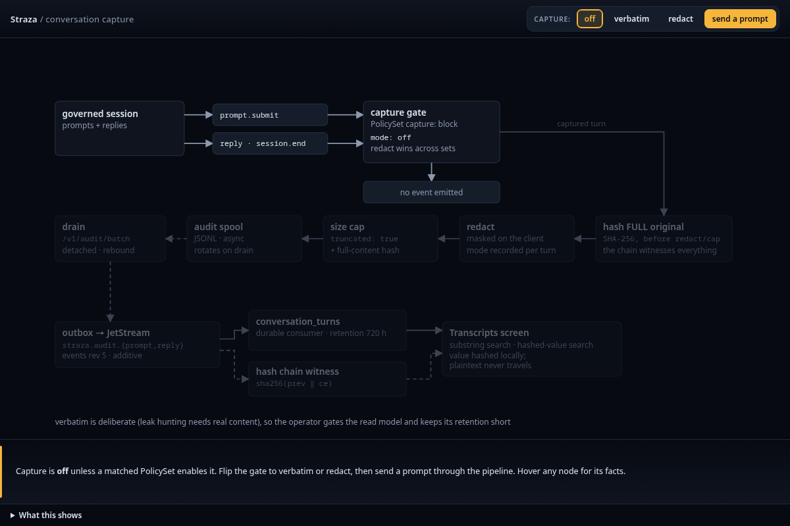

Every decision Straza makes leaves an audit record that says who acted, what was asked, which rule decided and under which policy. The records form a hash chain, so you can check later that none was edited or removed. Records are written after the decision, so in normal operation a tool call never waits for its record. A sink forwards the records to a system you control, such as your SIEM. Conversation text is recorded only when a policy turns it on.

## What a record holds

A record of a local tool decision names the session, the user and the harness that acted. It holds the event kind, the tool and the command, plus the paths and the workspace when the event carried them. It also holds the effect, the rule id, the name of the PolicySet whose rule decided, the reason and the id of the snapshot the decision was made under.

A gateway decision holds the same identity fields plus the MCP server, the server's own tool name and the tool arguments as sent, capped at 8 KiB with a marker when cut. When no rule fired and a profile default decided, the rule id and the set name are empty instead of a guess. The snapshot id matters most later. Policy text can change tomorrow, and the record still names the exact state that governed.

The chain carries more than tool decisions. Every admin change names the principal who made it and the credential path it came through, so a leaked token shows as the token that acted. Sign-ins and refused sign-ins, session ends, the kill switch and its lift, each phase of an approval with its decider, and the verdicts of the audit sentinel all ride the same chain. [Overview and Audit]() shows how to find and read them in the console.

## How a record reaches the chain

A client writes its decisions to a local spool and uploads them in batches. The server files each record under the signed-in user. A client may submit only tool decisions and recorded prompts and replies, so it can never write an admin, sign-in or identity record into the chain.

Server decisions enter an in-memory queue first. From there each record moves to a durable outbox in the database, then through the event bus into the hash chain. The record therefore trails its decision by a short time, and revocations and other control events go ahead of audit traffic.

Records can be lost before they are durable. A server crash loses the records still in memory, and the client's spool is bounded, so a full or unwritable spool loses records too. When the server's queue is full, the enterprise profile makes new server decisions wait for room and then refuses them, so nothing runs without its record. The standalone profile drops such records and counts the loss, as [Standalone and enterprise compared]() shows. [Known limits]() lists how to watch for loss.

## Why the chain can be trusted after the fact

Each record stores the hash of the record before it, and its own hash covers that link and its own bytes. Changing or removing a record breaks the chain at that point. `strazactl audit verify` walks the records in order and prints the count of verified records, or the sequence number where the chain broke. Over TLS or on localhost, the Overview card re-hashes the 25 newest records in your browser, and the Audit screen re-hashes every record it has loaded, starting with the newest 200.

The chain proves that no record was edited or removed in place. It does not by itself defeat someone who owns the database and rewrites every later record too, because a verify run inside that database recomputes the rewritten chain and finds it consistent. An off-box copy defeats that attack. Forward the records to a sink you control, and a rewritten record no longer matches the copy the sink already holds.

## Sinks and what the default leaves out

A sink forwards records to another system. Webhook sinks send signed HTTP requests, one record each or batches as newline-delimited JSON. File sinks append records and sync before they acknowledge them.

Delivery is at least once, so a receiver must tolerate duplicates. An outage delays delivery, and a delivery the receiver refuses can be parked and replayed. Watch delivery failures and retention limits instead of treating a configured sink as proof that every record arrived.

Without a subject filter, a sink receives every record except recorded conversation content. Forwarding transcripts takes an explicit choice in its configuration. [Sinks and SIEM]() sets one up.

## Transcripts are opt-in

Conversation recording is off until a PolicySet that matches the session turns it on, and the session is told that it is recorded. Prompts and replies are hashed in full before any redaction or size cap, so the chain witnesses what it did not store. When two matched sets disagree, the redacting mode wins.

The chain keeps the hash and the size of each turn, never its text. The text lives only in the transcripts store, which deletes it after 30 days by default, or in an object store you configure for the enterprise profile. A search for a leaked secret hashes the value on your side and matches the hash, so the plaintext never travels. [Record a conversation]() turns recording on.

## The sentinel is detection, never prevention

The audit sentinel reads the records after the fact and judges whole sessions instead of single events. Its detectors are rules that look for bursts of denies, a deny followed by a variant of the same command, a write followed by running what was written, and similar patterns. Its verdicts land on the same chain. Unlike every decision path, it fails open with an alarm, so a stopped sentinel blocks nothing and leaves a gap in detection. It is off by default and never revokes anything on its own, as [The sentinel]() explains.

## Why the record works this way

A log that can be edited proves nothing, and a log that slows the agent gets turned off. An audit trail for agents has to be complete, because a missing decision looks the same as an allowed one. It has to show tampering, because the first question after an incident is whether the record itself was touched. Staying off the agent's path matters too, since a shell command that waits on a database write is a tax every developer feels. Straza answers with a pipeline that runs after the decision and ends in a hash chain, and each record is shaped so a reviewer can say who did what, under which rule and which policy, from the record alone.



A record's own hash is the SHA-256 of the previous record's hash, a newline and the record's bytes. The bytes are stored as text and never re-rendered, because a store that reformatted them would hash a representation instead of the record. The verifier reports the first record whose previous hash does not equal its predecessor's hash, or whose own hash does not recompute. Names the admin API adds for display, such as the username behind a user id, live outside the hashed bytes, so that enrichment can never invalidate a record.

After the server accepts a batch from a client's spool, the client removes it, and event ids let the server drop a retried duplicate. On ingest, an event that names no session takes the uploader's session. One that names an earlier session of the same user on the same device keeps it, which happens when a client uploads records it spooled before a new check-in. A record that names a session of another user or another device, an unknown session, or a value that is not a session id is refused. It stays out of the chain, strazad logs one warning line for each session an upload names this way with the count of records it covers, and `straza_audit_refused_total` counts each record. The client has already deleted it. The server files any other event type a client sends as a tool decision.

Once a record is committed to the transactional outbox, a relay publishes it to the event bus, NATS JetStream, and a consumer appends it to the audit chain. The relay drains control events such as revocations before audit traffic. [The security model]() describes the queue and spool limits.

The detailed view below follows a recorded conversation from the governed session through the policy gate, hashing, redaction and the spool to the chain.



Read next: [MCP servers and the gateway]() explains the path where the gateway decisions above are made.
