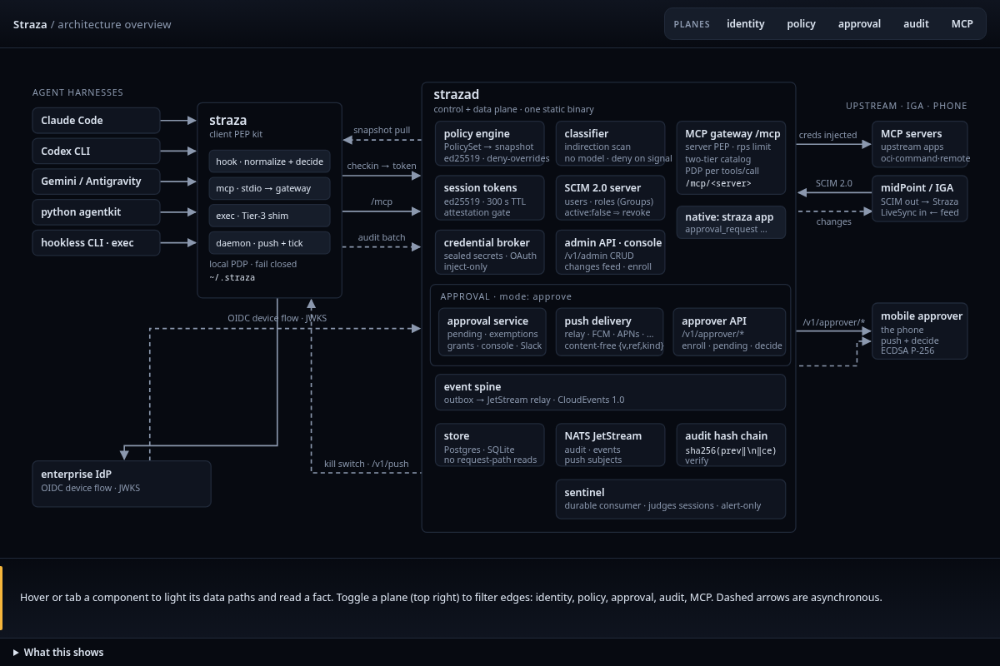
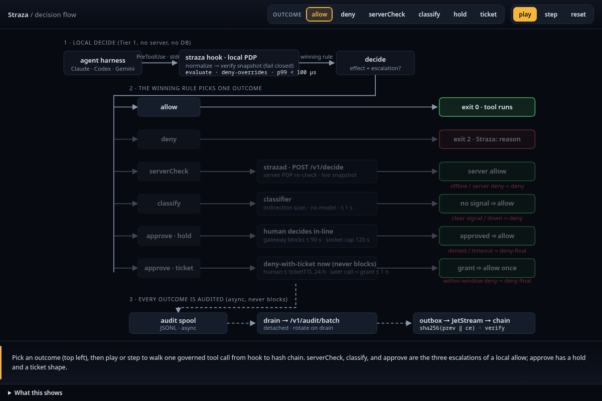

When an agent asks to run a tool on its machine, the straza hook there decides before the tool runs. It decides from a signed copy of your policy that it already holds, so the decision does not wait on the network. A rule that allows or denies ends the call there, and a denied agent reads the rule's reason. A few rules ask for more first: a person's approval, the requester's own confirmation, a built-in check of the command, or a second decision on the server.



## The outcomes

The rule that wins decides the call. A deny is final. A winning allow can carry a mode that adds one more step before the tool runs.

| Outcome | What happens | What the agent sees |
|---|---|---|
| allow | The tool runs. | Nothing. The call goes through. |
| deny | The tool does not run. | The rule's reason, which it should pass on to you instead of retrying. |
| approve | A person decides first. A hold waits a short, bounded time for the decision. A ticket can wait much longer, and a later call uses the approval once. | A reference to the request. At the gateway the call is held for a while first. On a hook the agent calls again after the decision. |
| confirm | Only the person behind the request can approve it. An agent that works without a person behind it is denied. | The same as an approval, until that person confirms. |
| serverCheck | strazad decides the call again with the live policy. If the server cannot be reached, the call is denied. | Allow or deny, as above. |
| classify | A built-in check reads the command before the allow stands, for example a download piped into a shell. If it cannot answer within one second, the call is denied. | Allow, or a deny that names the signal it found. |

Every outcome that needs something it cannot get, such as a server it cannot reach or a decision that never comes, ends in a deny. [Policies]() explains how rules match and combine, and [Approvals]() covers who decides. [What the agent reads back]() quotes each answer, and [Lifetimes and timeouts]() lists how long each wait lasts.

## Where the policy comes from

An admin activates a PolicySet. strazad compiles every active set into one snapshot and signs it. Each client fetches the snapshot, checks the signature against the keys it pinned when the machine enrolled, and uses it only after that check passes.



If a new snapshot fails that check, the client keeps the last one that passed until its session time runs out, and then it denies.

## Where calls are decided

Three paths lead to the same policy engine and the same snapshot format, so a rule means the same thing on each of them.

- The harness hooks govern an agent's local tools in Claude Code, Codex CLI and Gemini CLI. The Python kit gives a plain tool loop the same decision by running the same binary.
- The MCP gateway at `/mcp` governs calls from any MCP client to the servers registered behind it, with no code on the agent's side. strazad decides each call there, serves only the tools the session's roles reach, and adds the server's credential without handing it to the agent.
- `straza exec` wraps a process that has no hooks, so every command it starts goes through the same local decision. The documented sandbox image makes that wrapper the process's only way to run anything.

An action that takes none of these paths is outside Straza's view. The [Trust model and limits]() page says what each path is worth.

The overview below shows the whole system around those paths, with strazad's stores and event bus, the identity feeds, the upstream MCP servers and phone approval around the client. Hover a part to light its connections.

## When Straza cannot decide

Straza fails closed, so an unknown state stops the agent instead of letting it run ungoverned. A missing binary, a snapshot that cannot be verified, a malformed hook payload, or an unreachable server on a call that needs it each end in a deny that names the cause and the next step.

When a client's token expires and the server is out of reach, a grace period sets how long the client keeps deciding from its cached snapshot. It is zero in the enterprise profile and 15 minutes in the standalone profile, as [Lifetimes and timeouts]() lists with every other limit. The cost is real. A bad deploy of strazad halts every enterprise agent until it is fixed, and a laptop that loses its network mid-session stops after the grace period. Deciding from stale state or allowing on error would turn every outage into an ungoverned hour, and the audit record could no longer claim that every action was decided.



A person's machine enrolls once, before its first call. `straza enroll` opens a device sign-in at the issuer that strazad advertises: your identity provider in the enterprise profile, or the built-in issuer in standalone. Enrolling registers the device and pins the keys that verify policy snapshots. The server returns a device credential that can only check in. A device credential lasts 30 days from its issue or its last renewal. A check-in renews it once it is past half that life, so a machine that stops checking in loses it 15 to 30 days after its last check-in.

At session start the hook checks in. strazad verifies the device credential and consults its in-memory denylist before it reads anything from the store. It then measures the attestation level of the install, resolves the user's effective roles, and mints an Ed25519 session token. The token binds the user, the session, the device, the harness, the attestation level, a hash of the roles and the active snapshot id. It lives 300 seconds, and every server path that consumes it verifies it without a database read. The answer also carries the knowledge packs bound to the user's roles. The hook tells the agent in its own context that governance is active and that a denied call carries its reason.

On the machine, the harness hands the hook its own event on standard input. An adapter for that harness turns it into one canonical event with a tool from a fixed list, and the engine evaluates it in memory against the verified snapshot. An allow exits 0 and the tool runs. A deny writes the reason to standard error and exits 2, so the harness does not run the tool and the model reads the reason. Gemini CLI reads a JSON decision on standard output instead and ignores the exit code.

The extra steps of the outcomes table run like this. Classify runs the built-in heuristic on the machine with a one-second deadline. Approve asks strazad to open a request for a person, or to use one already decided. Confirm does the same with the requester as the only decider. With serverCheck, the client sends the call to strazad, which decides it again online.

A snapshot is built when a set is activated. Activation writes a CBOR document, signs it with the server's Ed25519 snapshot key, and names it by the SHA-256 of the signed bytes, so two identical policy states have the same id. The client verifies the signature against its pinned keys and checks that the id matches the bytes. A live client looks for a new snapshot after a decision, on the daemon's 30-second tick, when it renews its token, and when a policy push tells it to pull at once.

Audit delivery follows the decision. The client spools its records and uploads them in batches. Server records pass through an in-memory queue to a transactional outbox, then through the event stream into the hash chain. Records in the outbox are durable, while a crash can lose server records still in memory. A full enterprise queue can delay a request, and the client's spool is bounded. [Evidence and audit]() explains the delivery path and its limits.

The project's speed budget for the local decision is under 100 microseconds at the 99th percentile on a snapshot of 10,000 rules. For the whole hook, process start included, it is under 25 milliseconds at the 95th percentile. The load rig under `test/load` reproduces both numbers on your own hardware. Classify and approve are exempt, because they are meant for a few chosen calls.

The decision is local by design. Straza could have asked the server on every call, the way an API gateway does. A tool call happens inside a person's editor and inside loops that run thousands of times an hour, and a round trip on each one would make governance the slowest thing in the loop and the first thing someone turns off. The price is distribution. Policy travels as a signed snapshot, and revocation travels as pushed events into in-memory denylists instead of a lookup. The server keeps the same discipline on the paths it owns. Nothing on the gateway or on the decide endpoint reads the database, any instance can serve any session, and a test in the repository fails when a request path touches the store.

The detailed view below shows every escalation and its timeouts on one interactive page.



Read next: [Identities and roles]() explains who a session belongs to and where that identity comes from.
