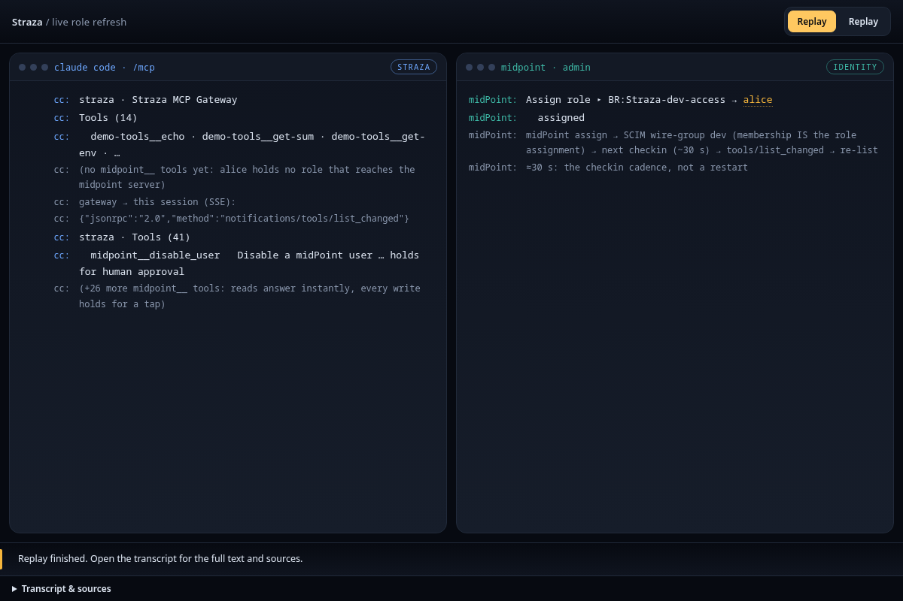
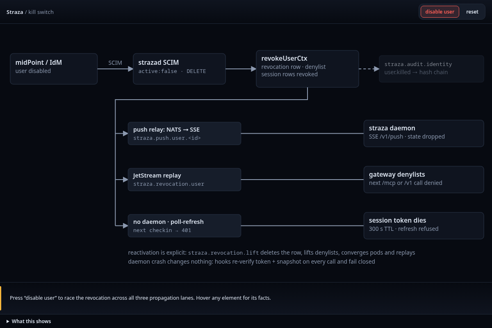

Every governed action belongs to a session, and every session belongs to a user. A user is a person, an AI agent or a service account. In the enterprise profile your identity manager provides the users and decides who holds which role. In the standalone profile you manage them yourself. A session's roles decide which MCP servers and tools it reaches, which policies apply to it and which knowledge packs it receives. When a user is disabled, Straza ends that user's sessions on every machine.

## Kinds of identity

Straza records whether an identity is a person when it creates it. An identity created with the agentic SCIM extension, or with the admin API kind `nhi`, is an AI agent or a service account. `nhi` is the wire word for both.

Your identity manager also keeps attributes on each identity that can change:

| Attribute | What it says |
|---|---|
| User type | Human, agent or service |
| Agency mode | Interactive, supervised or autonomous |
| Sponsor | The accountable person |
| Swarm ID | An optional name for a fleet |

An identity typed as an agent or a service counts as `nhi` even when its connector cannot send the agentic extension. Policy can select on these attributes. An AI agent or a service account is refused on the admin API and on every route that decides a request, whatever roles it holds, and it can never decide an approval on any channel, Slack included. [AI agents as identities]() shows how your identity manager sends them.

## Where users and roles come from

In the enterprise profile, identity arrives over SCIM 2.0 from your identity manager or IGA. Without a system that speaks SCIM, the admin API and the CLI create users. Over SCIM, users are created, replaced, patched and deactivated, and Straza's roles appear as SCIM groups. Membership in such a group is the role assignment.

Roles are born in Straza. Your identity manager imports them and decides who holds each one, and SCIM refuses a request to create or delete a role.

In the standalone profile there is no identity manager. The first start creates a local admin, and you create users in the console or with the CLI. [Connect identity]() connects midPoint, Okta or any other SCIM client.

## Roles

Each role has one kind:

| Role kind | What it represents |
|---|---|
| Business | The job or responsibility assigned to a person or agent |
| Application | Access to one MCP server and the tools on it |
| Approver | Authority to decide approval requests, with no tool access of its own |
| Straza | Administrative rights inside Straza, with no agent tool access of its own |

A business role composes application roles. A session's effective roles are its direct assignments plus every role they compose. Someone who works across several MCP servers can therefore hold one business role that composes one application role per server.

Policies match application roles, because those roles carry tool access. The SCIM view of a role also shows the servers, tools and policies behind it, so an identity governance review sees both who holds a business role and what it grants. A role can also carry a knowledge pack, text that each session of the role starts with, as [Knowledge packs]() shows.

A role added or removed in the identity manager reaches a running session at its next check-in. The gateway then tells the MCP client to list its tools again.

## The accountable human

An agent that needs a person's decision goes to its sponsor by default. The sponsor is a link your identity manager keeps on the agent's user. Straza reads it when an approval is raised and stores it on the request, so a later change of sponsor never moves an open request. A usable sponsor is an active person other than the requester. An agent cannot sponsor an agent, because that leaves no person accountable.

When a rule names no approver role and the agent has no usable sponsor, the request is denied at once, and the reason names the cause and the fix. An agent without a sponsor therefore cannot raise an approval until your identity manager records one. That is on purpose. Model the accountable person before the agent goes to work.

A person needs no sponsor. When a person runs their own agent under such a rule, that person is the accountable one, and the call waits for their own confirmation on a phone or browser they enrolled. If your identity manager records a sponsor on a person, as it may for a contractor, that sponsor decides instead. [Approvals]() covers who decides in full.

## Devices and sessions

A coding assistant on a laptop, a fleet worker deploying from CI and a personal agent acting for a manager all look alike at the tool boundary. Straza tells them apart by treating each session as an identity of its own. A session is one run of a harness, and its token names the user, the device, the harness and the session. Decisions, approvals and audit records therefore all point at one accountable chain, and you can revoke one session or one device without touching the user's other machines.

A person enrolls each machine once with `straza enroll`, and the machine becomes a device of that user. Each check-in measures the install, and the session gets an attestation level of `none`, `advisory` or `managed`. By default the enterprise profile issues no session below `managed`, and the demo stack lowers that minimum to `none` for a local lab. The gateway checks the deployment's minimum again on every call. [Enroll a machine]() explains each level and the device credential a machine keeps.

AI agents and service accounts run sessions without a device, because a fleet worker has no laptop to enroll. They never hold a password and never see a browser. A headless agent proves itself with its own Ed25519 key that an admin registered, or with your identity provider's client credentials, and gets a fresh short token at every session start. Straza refuses such a key for a person, so a stolen key can never stand in for a person's password. Deleting the key fails the agent's next session start, and [Headless agents]() sets one up.

## The kill switch from the identity manager



Disabling a user in your identity manager sends a SCIM deactivate, and Straza revokes every session of that user. A machine running `straza daemon` receives the revocation as a push and denies from then on, and the project's target for that path is two seconds. A machine without the daemon learns of it when it next renews its session token, so within the 300 seconds a token lives. The gateway refuses the session's next call at once. [Lifetimes and timeouts]() lists these bounds, with the offline grace of a standalone client that cannot reach strazad.

A revocation of the user is a lockout, and the client never retries it. When an admin revokes one session instead, only that session ends. The client's next session start opens a new one, which every check-in gate judges again.

Reactivation is deliberate and partial. Setting the user active again over SCIM lifts only the revocations your identity manager created. A lock placed from the console or by a security automation survives any reconciliation from the identity manager, and the refused lift lands on the audit chain. Existing sessions stay revoked, and the user's next check-in opens a new session without a new enrollment.

A SCIM deactivation also deletes the user's own credentials on MCP servers, the OAuth grants and pasted tokens, so a reactivated user connects those servers again. A disable by a Straza admin leaves them in place. The kill and the lift each leave an identity record on the audit chain that names where it came from, so an auditor can see which authority acted.

## Why the identity manager stays the master

Straza could own users and roles itself and ask you to keep two directories in step. It does not, because the joiner, mover and leaver processes, the certification campaigns and the recertification evidence already live in your IGA. A second source of truth is where offboarding gaps come from.

The cost is a dependency. An enterprise deployment without a SCIM feed or an admin API integration has no users. The admin API token that carries provisioning, through its `scim:write` scope, can also assign the admin role, because your identity manager masters every role, the ones Straza defines included. Control that at the identity manager, where role assignment is decided anyway. An AI agent that holds the admin role is still refused on every admin route.



Straza keeps no separate group object. A SCIM group is a role in the shape identity systems speak, and a request to create or delete one answers 501.

Every device has a status of its own, which each check-in reads again. A session is fixed at its start to its device and its attestation level, and every audit record and approval it produces names it. Enrollment turns the short login token of the device sign-in, ten minutes at the built-in issuer, into a longer-lived device credential. That credential is bound to the user and the device, opens only the check-in, and is checked against the denylist and the user and device status on every use. [Credentials and sessions]() follows it through its whole life.

On a SCIM deactivate, strazad marks the user disabled, writes a revocation and adds the user to its in-memory denylist. It then revokes the session rows and emits a revocation event. Every other strazad instance replays that event into its own denylist, and the client daemon receives it over its push stream. A daemon that gets the push drops the session state at once, and every hook denies from then on.

The next gateway call from a revoked session answers 403 with the reason that the session was revoked, and the decide endpoint answers a deny that carries the same reason. Automatic renewal on the client never retries a 403.

The detailed view below follows the race after a disable over the push stream, the event replay and the token lifetime.



Read next: [Policies]() explains what a role's policies are made of.
