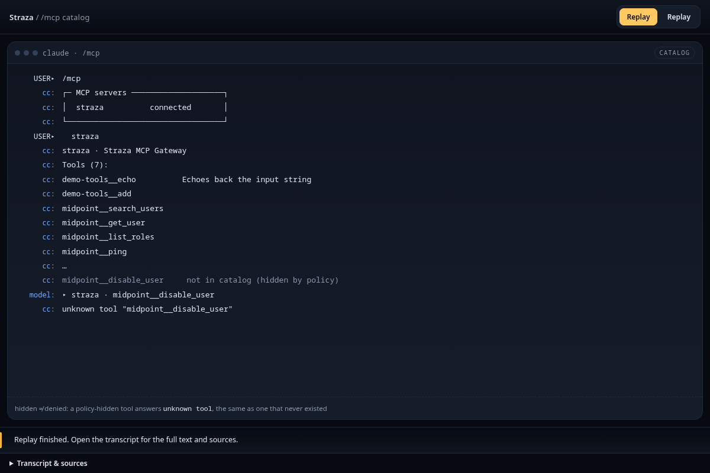
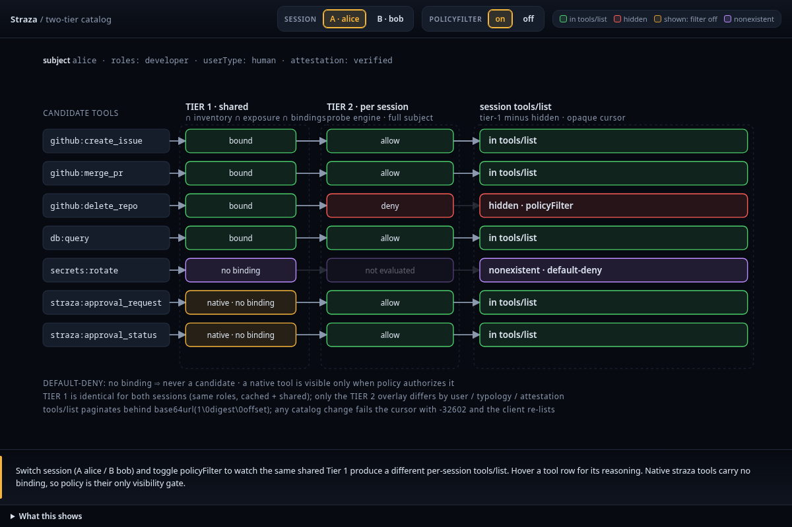

The MCP gateway gives an agent one connection to every MCP server you register in Straza. A session sees only the tools its roles reach, and by default the tools that policy denies are hidden from it. On each call the gateway decides with policy, asks a person when a rule says so, and adds the server's credential itself, so the agent never holds it. Every call leaves an audit record with its arguments.

The gateway governs the calls that go through it. An agent that has its own route or credential to an MCP server can skip the gateway, so remove those routes when you deploy.



## From MCP server to manifest

A manifest is one YAML document that declares an MCP server. It keeps the `server.json` document of the MCP Registry format and adds a Straza block for governance and runtime settings.

The server's name becomes both its policy identity and its tool namespace. Policy can select `apps: [github]`, for example, and a tool reaches the agent under a name such as `github__create_issue`.

The Straza block picks one of three runtimes, a child process that speaks MCP over standard input and output, a remote server over streamable HTTP, or a container image. It can also limit the tools the server exposes, set a request rate and an upstream timeout, and declare how Straza adds a credential. Unknown fields fail the install instead of being ignored. The enterprise profile refuses a command server and asks you to run it as its own service, as [Standalone and enterprise compared]() shows.

`strazactl apps import` turns an MCP Registry entry into a manifest. It prefers a remote over streamable HTTP, then a container image, an npm package or a Python package. Exactly one secret variable or header becomes the credential declaration. [MCP servers]() adds, imports and runs servers.

## The catalog each role sees

The gateway builds a session's tool list in two stages:

1. Straza intersects the tools the server lists now with the manifest's exposure list and the access rows of the session's roles. Only the tools in all three become candidates.
2. The gateway runs policy for the session. With policy filtering on, which is the default, a tool that policy denies is hidden. A tool that needs a person's approval stays visible and asks for a justification.

An access row already admits a tool, so a candidate that no rule gates runs. A tool without access and a tool hidden by policy return the same unknown-tool error, so the error never reveals whether a hidden tool exists.

A role assigned in the identity manager reaches a running session at its next check-in. The gateway then tells the client that the tool list changed, so the client lists again without a restart. Before any agent starts, `strazactl catalog preview` shows what a role or a user would see, with one status per tool and a sentence that says why: runs, gated by approval, denied by a rule, no access, not in the role's access row, or not running. [Access per role]() grants access and checks the preview.

## Credentials stay on the gateway

A manifest picks one credential kind:

| Kind | How it works |
|---|---|
| `none` | The server needs no credential |
| `static` | An admin stores a server secret and may add overrides for particular roles |
| `token` | Starts with the caller's own pasted token. A configured agent can fall back to its sponsor's token or a shared one. |
| `oauth` | Starts with the caller's own browser grant. A configured agent can use its sponsor's grant, a shared one or a client-credentials path. |

Straza adds a static value as a header for a remote server, or as an environment variable for a child process. `oauth` and `token` belong to the caller and work only with remote servers. Straza resolves the current caller's own credential for each call, and a person who has none is denied. For an agent without its own, the manifest can deny the call or name a sponsor, shared or client-credentials path.

For every kind that needs a credential, a missing one denies the call instead of reaching the server without it. Straza's management APIs show metadata, never stored values, and server lists and exports mask the secret-shaped values in a manifest. The agent's Straza session token is never forwarded to the server. The server receives the credential and can return its own content, so it stays part of the trusted integration. [Credentials]() stores one.

## The gateway on the path

strazad serves the gateway at `/mcp`. To an agent it is one MCP server named Straza MCP Gateway, and every request carries a session token. For a tool call, the gateway checks these in order:

1. Whether the session may see the tool.
2. The server's rate limit for this session.
3. Policy, against the live snapshot.
4. A person's approval, when the rule asks for one.
5. The server's credential.
6. An audit record with the arguments. The gateway queues it before the call and does not wait for it to be written.
7. The call itself, with a 30-second timeout by default.

A deny comes back as a tool error whose text starts with the Straza prefix and carries the reason, so the model reads the reason instead of taking it for a transport fault. The built-in MCP server named `straza` adds three approval tools on the same surface, and policy decides whether they are visible.

A harness that already runs hooks reaches the gateway through `straza mcp`, a stdio proxy that `straza install` registers as the one MCP server the harness knows. The harness then puts its own prefix in front of the server and tool names. Container runtimes start under a sandbox by default, with a read-only root, all capabilities dropped, no new privileges and no network. [Any MCP client]() connects a client without hooks.

## Why a gateway, and what it costs

The alternative hands each agent its own credentials and trusts the agent's machine to use them well. Straza rejects that, because a credential on the agent's machine is one the model can read, print and send, and no hook on an open machine can stop a process that already holds it. Keeping the secret on the gateway makes the gateway path hold at a boundary even when the agent's machine does not.

The price is a hop and a dependency. Every governed MCP call crosses the gateway, an unreachable gateway means no MCP tools at all, and the gateway is one more service to run at the scale of your fleet. It is designed to be stateless, so instances scale sideways and any instance serves any session.



The gateway verifies each request's session token against cached keys, then checks the denylist and the required attestation. If this strazad instance has not seen the session since its last restart, it asks the client to check in again.

Large catalogs come in pages behind a cursor that checks itself against the catalog it was issued for. An access row or policy change under a paging client fails the cursor, and the client lists again from the start.

For a static credential, Straza first looks for an override on the role whose access row admitted the call. If that role has none, it checks the overrides of the session's other roles in role-name order, and then uses the server secret. The server secret also feeds the health probe.

Static rows stay sealed in an in-memory broker and are decrypted when Straza resolves them, so the request path never reads the store. A command or container server that needs a static credential stays pending until one is configured. A remote server with a static credential needs it for its inventory and its health checks as well as for tool calls.

The detailed view below shows the two stages a candidate tool passes before it appears in a tools list.



Read next: [Trust model and limits]() states what each enforcement path is worth.
