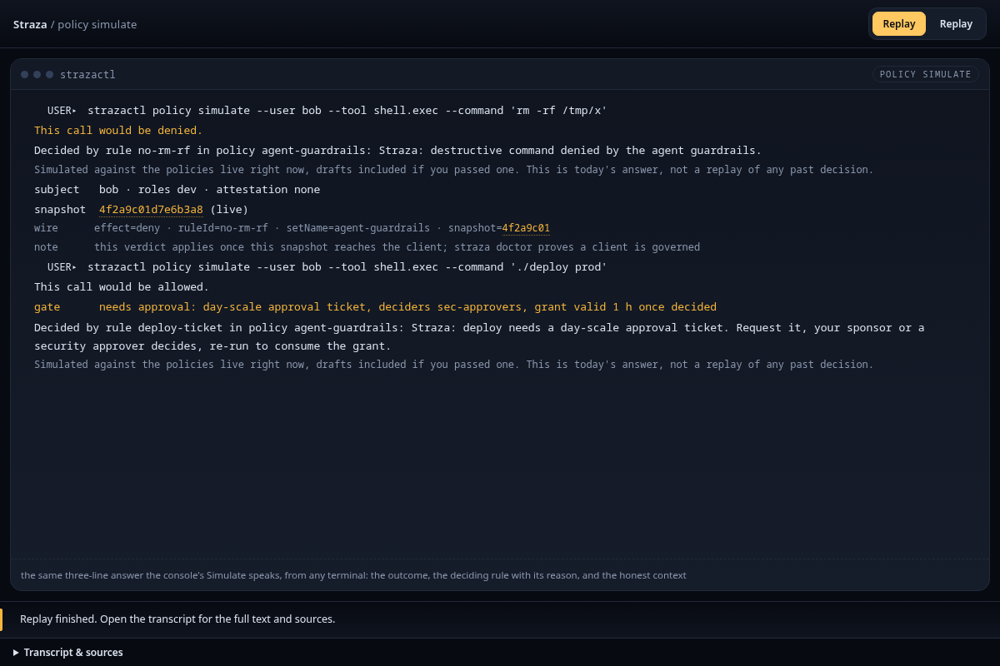
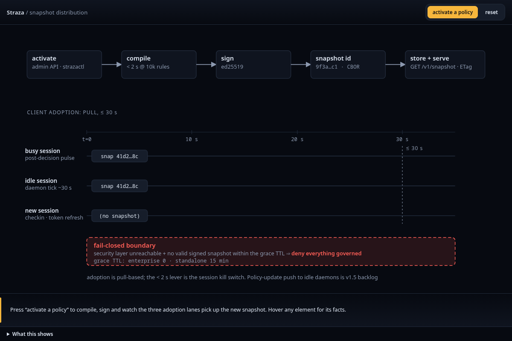

A policy is a PolicySet, a YAML document of rules. It selects the sessions it applies to by role or by user, and each rule matches a kind of action, such as a shell command, a file path or a tool on an MCP server. When several rules fire, a deny wins over any allow. A winning allow can ask for one more step before the tool runs, such as a person's approval. strazad compiles every active set into one signed snapshot, and each machine decides from its own verified copy.

Adding a set does not always narrow access. An allow rule can let through an action that the profile would deny when no rule matches.

## What a PolicySet looks like


```yaml
apiVersion: straza.dev/v1beta1
kind: PolicySet
metadata:
  name: agent-guardrails
spec:
  priority: 150
  match:
    roles: [demo-tools-sandbox, midpoint-self-service, midpoint-operations, demo-tools-readers]
  rules:
    - id: local-tools
      events: [tool.pre]
      tools: [shell.exec, file.read, file.write, file.edit, net.fetch, task.spawn]
      effect: allow
    - id: no-rm-rf
      events: [tool.pre]
      tools: [shell.exec]
      command:
        denyPatterns: ["rm -rf *", "git push --force*", "curl * | *sh*"]
      effect: deny
      reason: "Straza: destructive command denied by the agent guardrails"
    - id: protect-secrets
      events: [tool.pre]
      tools: [file.write, file.edit]
      paths:
        deny: ["**/.env*", "**/id_rsa*", "**/credentials.json"]
      effect: deny
      reason: "Straza: secret-file writes denied by the agent guardrails"
```

This excerpt comes from the set the demo stack seeds for every session it governs, with several rules, the recording block and the comments removed. The full set is `deploy/compose/eval-stack/seed/policies/agent-guardrails.yaml` in the repository. Each application role's own gates live beside it, in a set named after the role plus `-access`.


A PolicySet has a name, an API version and a `spec` with these parts:

| Part | What it does |
|---|---|
| `match` | Selects the sessions the set applies to, by role, by user or by identity attributes. An empty match selects every session. |
| `rules` | Match actions and decide whether they may run. |
| `capture` | Optionally records the conversations of matching sessions. |
| `escape` | Optionally runs a Rego module after the rules. It can only add denies. |

The [PolicySet grammar]() lists every key with its type, its default and an example.

## How a rule matches a call


Every governed action reaches the engine as one canonical event, whatever harness or path it came from. The event names a tool from a fixed list, such as `shell.exec`, `file.write` or `mcp.call`. A rule applies when the event kind is in the rule's `events`, the tool is in its `tools` if it lists any, and, for a rule with an `apps` list, the call goes to one of those MCP servers. A rule with an `apps` list never applies to a local tool.

An applying rule checks its `require` block first, such as a lowest attestation level, and a session that falls short gets a deny. Its pattern lists come next, deny side first. A match on a deny list denies, a match on an allow list allows, and a rule whose lists match nothing does not fire. Without any lists, the rule's `effect` is the verdict.


A set can also select on the identity's user type, agency mode or swarm ID. An identity without those attributes matches no such selector. A deny scoped that way therefore misses the identities that carry none, and a person-scoped allow can never undo a broader deny. If people need different access, scope the deny so it does not reach them. Simulate both kinds of identity before you activate the set.

## The outcomes


A plain rule ends in allow or deny. Every deny carries the rule's reason, and when the author left it out the engine writes one that names the set and the rule, so the agent always reads why.

A mode on a rule adds one step to a winning allow, and only to a winning allow, because a deny is final. Each step fails closed:

| Mode | What it checks | What a failure does |
|---|---|---|
| `serverCheck` | The client on the machine asks strazad to decide the call again before it acts | An unreachable server is a deny |
| `classify` | The built-in heuristic inspects a shell command for a command hidden inside another, such as a pipe into a shell or an encoded payload | A clear signal denies, and so do an error or a blown deadline |
| `approve` | A person decides before the tool runs, on a hold that keeps the gateway call open or on a ticket that lasts for days | A timeout, an explicit denial or an unreachable approval service is a deny |
| `confirm` | The requester alone confirms, which guards against an agent's mistake and prompt injection, never against the person | A timeout or a refusal is a deny, and an autonomous session gets a plain deny at once |

[How a tool call is decided]() shows what the agent sees for each outcome, and [Approvals]() covers the paths where a person decides.

## How sets combine


Straza evaluates every set that matches the session and gathers the rules that fire. An explicit deny wins. Among the rules with the winning effect, priority picks the one whose reason the decision reports, and ties go to the set name and then the rule order. Priority never lets an allow beat a deny.

When no rule fires, the call takes a default:

| Call | Result |
|---|---|
| An MCP tool that one of the session's roles has access to | Allow, because the access row already admits it |
| An MCP tool that none of the session's roles has access to | Deny |
| A local tool | The profile's default, an allow in standalone and a deny in enterprise |

[Standalone and enterprise compared]() names the setting that changes the local tool default.


Straza checks the roles a set names when you validate it and again when you activate it. The roles in `match` must be application roles, the kind that carries access, so naming one covers every way a person holds it. The roles an approve rule names must be approver roles or the admin role, so an application role never doubles as the authority to decide. A name that is no role yet stays legal in `match`, and it matches nobody until the role exists.

## Where the policy comes from




Policy lives in Straza's database, and you change it in the console, with strazactl or through the admin API. You upload a set kept in git from its file with `strazactl policy apply`. A new set is stored off, and an edit to a live set waits, listed as Live, edits not published, until you activate that set. Any change can also wait as a draft until a person publishes it, as [Propose and publish a change]() shows.


Activation compiles every live set into one snapshot, signs it and names it by a hash of its bytes, so a decision record can name the exact policy state it was made under. A client uses a snapshot only after the signature and the name check out. The snapshot is signed and never encrypted. In the standalone profile anyone who can reach the listener can read it, while the enterprise profile serves it only to a checked-in session, as [the comparison]() shows. Treat policy as configuration, and never put a secret in it.

## Simulate before you activate


Validation runs the same parser the snapshot compiler uses, so the console and a set imported from git get the same refusal at the same moment. Simulation takes one call and one subject, a user or a list of roles, and evaluates it against the active snapshot. It can lay a set from a local file over the stored set of the same name, so you see what activation would change before anything changes. The answer names the effect, the deciding rule with its reason, and the snapshot the verdict came from. [Simulate a call]() walks it.



## Why a small declarative shape


A policy that governs agents has to be readable by the person who answers for the agent. It also has to be evaluated thousands of times an hour without a server in the loop. General policy languages meet the second need and fail the first, because nobody on a security review wants to read Rego to learn whether an agent may push to main. Straza chose a small declarative shape that a reviewer reads top to bottom, with a Rego escape hatch that can only tighten a result. The price is expressiveness. What the shape cannot say, you say with two sets or with an approval.



Patterns are globs, anchored to the whole value, or Go regular expressions behind a `re:` prefix. A command pattern runs against the raw command string, against the argv joined with single spaces, and against every single argv token, so quoting and whitespace tricks do not slip past a deny. Paths are cleaned before matching. An event that touches several paths is denied when any path matches a deny, and allowed only when every path matches an allow.


An escape module runs with a 100 ms deadline, checked between evaluation steps. It may not call a built-in that reaches the network, the file system or the process environment, or one whose single call can run far past the deadline, and the [grammar page]() lists each refused built-in.


Session start, prompt submission and the other events that are not tool calls are allowed and audited. An event of a kind Straza does not know is denied in both profiles, and the reason lists the kinds it knows. A tool outside the canonical set, or a tool call that names no tool, takes the local tool default, and where that default denies, the reason lists the tools Straza knows.


The gateway checks tool visibility before policy runs. The fact that an access row admits a tool comes from the gateway, never from the client's request. Straza's built-in approval tools never carry it, so policy alone gates them. The two drafting tools, `draft_submit` and `draft_status`, carry it, because the gateway lists them only to holders of the Straza role `straza-draft-config`.


Activation sorts every live set by name, compiles them into one CBOR document, signs it with the server's Ed25519 key and verifies the result itself. The snapshot's id is the SHA-256 of the signed bytes, so two identical policy states have the same id.

The detailed view below shows how live clients pull a new snapshot after an activation.




Read next: [Approvals]() explains what happens when a rule asks for a person.
