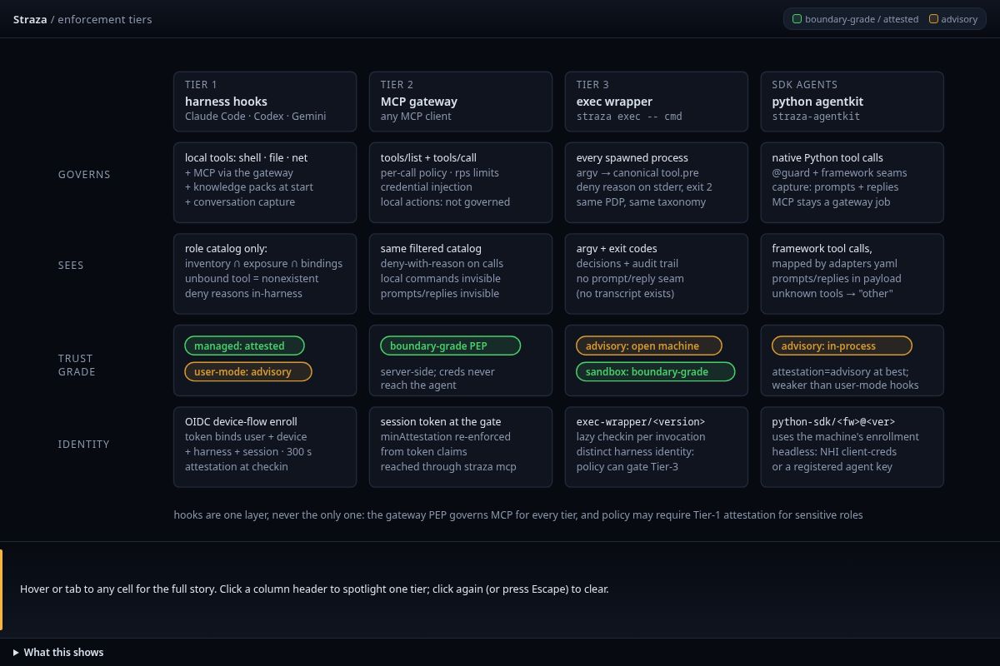

Straza decides the actions that pass through its hooks, its MCP gateway or its exec wrapper, and an action that takes none of these paths is outside its view. How much a decision is worth depends on where it is made. On a machine the agent controls, a hook is advice that an agent able to run anything could skip. At the gateway, where the secret never reaches the agent, and inside the sandbox image, where the wrapper is the only way to run a process, the decision holds at a boundary. No AI runs inside the product, and no page here claims that using Straza makes you compliant with any regulation.

[Known limits]() lists every risk Straza leaves with you, with what reduces it today and what the roadmap plans.

## What Straza defends against

Straza checks the actions that pass through its installed hooks or its MCP gateway. Policy can deny destructive commands, restrict which tools a session reaches, or require a person's approval. The gateway also enforces the rate limits you configure.

Session tokens expire and can be revoked, and a holder can refresh an active session until the session's lifetime ends. A stolen device credential can start new sessions until you revoke the device or disable the user. [Credentials and sessions]() explains refresh and revocation, and [Lifetimes and timeouts]() lists each limit.

Clients verify policy snapshots against keys pinned at enrollment. A snapshot that fails verification is never enforced, and the client keeps the last verified one until its session time runs out, then denies. Managed installations also measure the binary, its configuration and the hook wiring, so the server can check them against its registry at check-in.

The gateway supplies stored credentials without returning them to the agent. Secrets are sealed at rest, and the audit chain can be checked for tampering. [The security model]() describes each check and its limits.

## What Straza trusts

Straza relies on these, and its own checks do not cover them:

- Your identity manager is right about who holds which role. It is the system your organization already audits, and a wrong assignment there is a wrong decision here.
- The operating system boundary of a managed install holds. The enforcement files are root-owned, and an admin with sudo on an endpoint owns every process on it. That stays a documented residual risk.
- Transport between the client and strazad is sound. The enterprise profile warns loudly when it serves plain HTTP, and no setting anywhere skips certificate checks.
- The operator who writes server manifests is trusted, because an install is a privileged act and a remote address is the operator's to review.
- A deployment's own claim that a session came from the sandbox image is trusted, because the server cannot verify that from the wire yet. Keep requiring attested `managed` sessions for a sensitive role anyway.

## Three enforcement lanes and what each is worth

| Path | What it governs | What it is worth |
|---|---|---|
| The harness hook | Everything the agent does on its machine, such as shell commands, files, network fetches and subagents, plus its MCP calls through the gateway | Advice in a user-mode install. A managed install is root-owned and checked at check-in. |
| The MCP gateway | Every call to a server registered behind it, with no code on the agent's side | Holds at a boundary, because the decision, the catalog and the credential all live on the server |
| `straza exec` | Every command a wrapped process starts | Advice on an open machine. Inside the sandbox image it is the process's only way to run anything. |

The hook is wired by `straza install` into Claude Code, Codex CLI or Gemini CLI. A user-mode install on an open machine is advisory, because an agent that can run anything can run around it, and its sessions attest as `advisory` at best. A managed install is root-owned and hash-checked at check-in, so its sessions attest as `managed`, and policy can deny anything less for a sensitive role. The Python kit sits on the same path with the same caveat. It governs the tool calls the framework routes through it, never the computation inside the process.

The gateway cannot see what the agent does outside MCP, so a deployment with the gateway alone governs MCP servers and leaves local commands ungoverned. The admin command line, the console and the self-service page can get a session below the attestation minimum, so an admin can always sign in. Such a session still cannot call MCP tools, because the gateway checks the minimum again from the token on every call.

On an open machine, `straza exec` is exactly as advisory as a user-mode hook. Inside the documented sandbox image it becomes the process's only way to make the kernel run anything. Two paths stay open there, as [Hookless processes]() states. Computation inside the interpreter is ungoverned, because the interpreter is the agent. Every binary on the image's allowlist runs without a decision, so a per-argument rule holds at the boundary only for a tool that is absent from the image. A tool whose arguments must be enforced belongs behind the gateway, where its credential stays on the server as well.

## No AI in the product

Every decision Straza makes is deterministic policy evaluation. The classify mode runs a heuristic with no model, no network and no state, which looks for a command hidden inside a shell command. The audit sentinel is a set of rules that runs after the fact and blocks nothing. Model traffic is never proxied. A proxy on the model's wire would see prompts and completions and miss the tool execution that matters, so prompts and completions stay on whatever stack you already run.

## What Straza does not try to do

- Straza does not govern thought. A model can compute anything inside its own process, and an agent's interpreter can read and write whatever its user id can, without a decision. Inside the sandbox, a read-only root limits what it can change, and a network you close limits what it can reach. Neither is a policy decision.
- Straza does not see what a script does when an agent writes it and then runs it. The interpreter call is tagged, so a rule can deny it or send it to the classifier, and the sentinel records the sequence afterwards without blocking it.
- An endpoint is not protected from its own root, and the server cannot yet verify from the wire which image a session ran in.
- Your identity manager is not replaced. Users, roles and offboarding stay there, and a deployment without an identity feed has nobody to govern.
- Using Straza is not a compliance certificate. It enforces decisions and produces evidence you can map to a control, and whether that satisfies a regulation is your assessment, made with the people who answer for it.



`straza exec` turns the argv of every process a wrapped program starts into a shell decision through the same engine the hooks use. In the documented sandbox image, the path holds only the shim, the wrapper shell and the agent's interpreter. Every other file on the image loses its execute bit at build time, and the build fails if one survives. With the documented runtime flags, the root filesystem is read-only, every writable mount is noexec, all capabilities are dropped and no process can gain privileges.

The network is a property of how you run the image. The shipped compose file leaves its container network routable so that a server on the host can be reached. Setting `internal: true` on that network, with only strazad attached, lets the agent reach strazad and nothing else.

A sensitive role asks for `managed` sessions through `governance.minAttestation` for the whole deployment, or through a rule's `require.attestation` for the calls that rule covers. [Enroll a machine]() explains how a session gets each level.


The [home page]() states in one line where Straza sits, and [How a tool call is decided]() shows the path one governed call takes.
