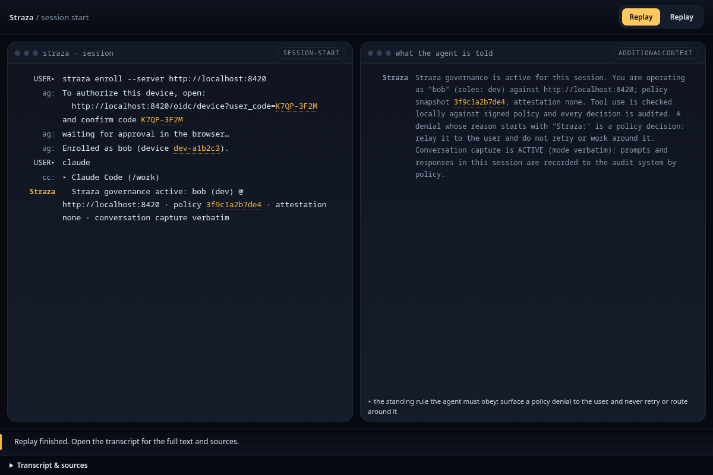

You start a server in the standalone profile, create a person called alice, and watch the policy that ships with the server deny a destructive command and allow a harmless one. The standalone profile carries its own database, event broker and sign-in page, so nothing else needs to run. Every step has a console form and a CLI form where both exist. The switch in the header picks one.

## Before you start {.nostep}


- The three binaries on your PATH: `strazad`, `strazactl` and `straza`. [Install]() shows how.
- An empty directory. The server keeps its data there, so use a throwaway one, and use a separate test machine if this one already runs Straza.
- A POSIX shell for the commands, and a browser on this machine for the sign-in page.

## Start the server


A server starts from a terminal. The console opens once it runs.

In the first terminal, in the empty directory, start the server in the standalone profile.


```sh
strazad serve --profile standalone
```


The log says `strazad serving` at `127.0.0.1:8420`. Leave this terminal running.

The first start prints the admin and break-glass passwords once, in the log. A restart of the same data directory does not print them again.


Passwords are masked here and timestamps left out.

```text
{"level":"WARN","msg":"bootstrap admin created. Store this password now, it will not be shown again","username":"admin","password":"6770xxxxxxxxxxxxxxxxxxxxxxxxxxxxxxxx"}
{"level":"WARN","msg":"break-glass admin created. Store this password in your vault now, it will not be shown again; rotate on-box via `strazactl users set-password break-glass`","username":"break-glass","password":"aef0xxxxxxxxxxxxxxxxxxxxxxxxxxxxxxxx"}
{"level":"INFO","msg":"strazad serving","addr":"127.0.0.1:8420","profile":"standalone","publicUrl":"http://127.0.0.1:8420","tls":false,"version":"v1.1.0"}
```


The server keeps its state under `data` in the directory where you started it. The standalone profile binds its main listener to 127.0.0.1:8420, so administration stays on this machine. Unless `server.approverTLS.autoMint` is false, it also serves the phone approver routes on port 8443 on every interface, with a self-signed certificate it creates in the data directory. Read [Ports and network]() before you run this on a shared network. [Standalone and enterprise compared]() shows how the enterprise profile differs.

## Sign in as the admin



Open `http://127.0.0.1:8420/console/` in your browser and press **Sign in with a code**. The console shows a one-time code.



1. Press **Open the sign-in page**. A new tab opens with the code filled in.
2. Check that the code matches, enter `admin` and the saved password, and press **Sign in**.
3. The tab says *Signed in. You can close this tab.* Go back to the console.

The console opens on Overview. The bottom of the menu says `standalone` and the server's build.



In the second terminal, log in. The command needs the server address once and remembers it for every later command.


```sh
strazactl login --server http://127.0.0.1:8420
```


It prints an address and a code, then waits for you.

1. Open the address in your browser.
2. Check that the code matches, enter `admin` and the saved password, and press **Sign in**.
3. Go back to the terminal.

`Logged in as admin.` and a note that asks you to keep this login away from coding agents.


The code changes with every attempt, so use the address and code from your own terminal.

```text
Open http://127.0.0.1:8420/oidc/device?user_code=NCPJ-QXXZ
and confirm code NCPJ-QXXZ
Logged in as admin.
note: this login can change Straza's configuration. Keep it away from coding agents. Automation uses an admin API token in STRAZA_API_TOKEN, and an agent proposes config changes through the built-in straza MCP server.
```




`Invalid username or password.`
: Use the admin password from the first start of this data directory. If you no longer have it, follow [Recover from a lockout](). Never delete the data directory of a real deployment to get back in.

`That code is not valid or has expired. Check it against the console or terminal and try again.`
: The sign-in page holds an old code. Start the sign-in again and open the new address, because a tab from an earlier attempt shows a stale code.

`login timed out (device code expired)`
: The code ran out before you signed in. Run `strazactl login --server http://127.0.0.1:8420` again.


## Create a person and a role


A role is a label you give a person. A **PolicySet** is a policy document with rules that allow a call, deny it or send it to a person, and its `match` block can name the roles it governs. You create alice and an application role called `dev`, because PolicySets match application roles.


The first two commands run in the CLI. The console has no Add user, because people come from your identity manager or the CLI. Its New role asks an application role for its MCP server, and `dev` reaches none.

In the second terminal, log the CLI in once, the same way as the console, then create alice and the role.


```sh
strazactl login --server http://127.0.0.1:8420
strazactl users create alice --password 'pick-a-passphrase' --email alice@example.com
strazactl roles create dev --kind application
```


`Logged in as admin.`, then `created user alice` and `created role dev`, each with an id that is different on your machine.

Back in the console, give alice the role. Open her sheet, pick `dev` in the **Assign** picker and press **Assign role**. The console asks you to confirm, so press **Assign role** again.





`dev` under Roles in alice's sheet, marked *assigned here*.



Create alice with a password for the built-in sign-in page, create the role and assign it to her.


```sh
strazactl users create alice --password 'pick-a-passphrase' --email alice@example.com
strazactl roles create dev --kind application
strazactl assign dev --user alice
```


Three lines: `created user alice`, `created role dev` and `assigned dev to alice`. The ids are minted per store, so yours differ.


```text
created user alice (01a0e993-0abd-79e1-a958-015170d2cc16)
created role dev (01a0e993-0ae6-7389-9e00-cb2f1cf2831e)
assigned dev to alice
```



## See the policy that already governs


A fresh standalone server starts with one live PolicySet, `standalone-starter`, so the first deny works before you write anything. Its one rule, `block-recursive-delete`, denies recursive force-deletes for everyone.






One row for `shell` with the six patterns, **Denied** under What happens, and `block-recursive-delete` under Rule.




```sh
strazactl policy list
strazactl policy show standalone-starter
```


One live set, `standalone-starter`, with the rule `block-recursive-delete`.


The `show` output below leaves out the set's description line, which says the set may be edited or deleted freely.

```table
NAME                PRIORITY  STATUS  ID
standalone-starter  0         Live    01a0e992-ffd3-76b8-a32f-ab27e32eff4c
```

```text
name        standalone-starter
status      Live
priority    0
updated     2026-09-28 19:52:00 +00:00
applies to  * everyone
rules       1 · denied 1 · needs approval 0 · checked 0 · allowed 0
apiVersion: straza.dev/v1beta1
kind: PolicySet
metadata:
  name: standalone-starter
spec:
  rules:
    - id: block-recursive-delete
      tools: [shell.exec]
      command:
        denyPatterns:
          - "rm -rf *"
          - "rm -fr *"
          - "rm -r -f *"
          - "rm -f -r *"
          - "sudo rm -rf *"
          - "sudo rm -fr *"
      effect: deny
      reason: "Straza starter policy: recursive force-delete is denied. Delete files individually, or an admin can edit the standalone-starter PolicySet."
```



The starter set can be edited or deleted like any other, and a deleted one is never seeded again. Writing a set of your own is the subject of the [Policies]() guides.

## Ask the policy what it decides


Before any agent tries a command, ask the live policy what it would decide. Neither form runs the command, writes anything or records anything.




1. Under **Who**, pick alice. Under **What**, pick **Shell command**.
2. Type `rm -rf /tmp/x` in **The command line** and press **Test**.



**Denied**, then *Decided by rule block-recursive-delete in policy standalone-starter* and the rule's reason. Test `git status` the same way and the answer is **Allowed**.




```sh
strazactl policy simulate --roles dev --tool shell.exec --command 'rm -rf /tmp/x'
```


`This call would be denied.` and the line that names the rule and its reason. The same command with `git status` answers that the call would be allowed.


```text
This call would be denied.
Decided by rule block-recursive-delete in policy standalone-starter: Straza starter policy: recursive force-delete is denied. Delete files individually, or an admin can edit the standalone-starter PolicySet.
Simulated against the policies live right now, your file included if you passed one. This is today's answer, not a replay of any past decision.

subject   roles dev · attestation none
snapshot  0b900684ea3244f6e1f81f760ed663d30d8a2b63bfb34d720535bf59b197d522 (live)
wire      effect=deny · ruleId=block-recursive-delete · setName=standalone-starter · snapshot=0b900684
note      this verdict applies once this snapshot reaches the client;
          straza doctor proves a client is governed
```



`git status` is allowed because no rule matches it, and the standalone profile allows a local command that no rule mentions. The enterprise profile [denies it instead]().

## Enroll your machine as alice


Enrolling happens on the agent's machine, so it runs in the client in both forms.

Enrolling binds this machine to alice, once per machine, through the same sign-in you used for the admin.


```sh
straza enroll --server http://127.0.0.1:8420
```


Open the address it prints, sign in as `alice` with the passphrase you chose for her, and press **Sign in**. While it waits, the command repeats the code every sixteen seconds and says how long the code stays valid.

`Enrolled as alice` and the id of this device.


```text
To authorize this device, open:
  http://127.0.0.1:8420/oidc/device?user_code=SFXZ-TM3X
and confirm code SFXZ-TM3X
waiting for approval in the browser…
Enrolled as alice (device 01a0e993-1360-71dc-a98a-78f82064b889).
```


Then ask the client what it knows.


```sh
straza status
```



```text
server     http://127.0.0.1:8420
identity   alice (device 01a0e993-1360-71dc-a98a-78f82064b889)
session    none (start a harness session)
```


There is no session yet, because a session starts when a harness checks in. At this point `straza doctor` reports the enrollment, the identity, the server and the approver surface as ok. It warns that no session, no cached policy and no harness wiring exist yet, and it follows each warning with the command that fixes it. Run it whenever a later step does not behave as written. [Enroll a machine]() covers enrolling with your own identity provider and what each check of `straza doctor` means.


`the device code expired before it was approved. Run enroll again and approve the NEWLY printed code (a browser tab from an earlier attempt shows a stale one)`
: Run `straza enroll --server http://127.0.0.1:8420` again and open the new address.


## Watch the hook decide {#watch-it-govern}


The hook runs on the agent's machine, so this step runs in the client in both forms.

A coding assistant such as Claude Code calls `straza hook` before each tool call and reads its answer. Here you send the hook the same events by hand, so you need no agent. The hook decides each call and runs neither command. This checks the hook itself, and a later section connects a real agent.

First open a session for alice.


```sh
printf '%s' '{"hook_event_name":"SessionStart","session_id":"first-session","cwd":"/root/work","transcript_path":"/root/work/transcript.jsonl"}' | straza hook --harness claude-code
```


A line of JSON that says Straza governance is active for alice, with her role `dev` and the policy she runs under.


```text
{"hookSpecificOutput":{"additionalContext":"Straza governance is active for this session. You are operating as \"alice\" (roles: dev) against http://127.0.0.1:8420; policy snapshot 0b900684ea32, attestation advisory. Tool use is checked locally against signed policy and every decision is audited. A denied tool call always carries its reason: relay it to the user and do not retry or work around the denial.","hookEventName":"SessionStart"},"systemMessage":"🛡 Straza governance active: alice (dev) @ http://127.0.0.1:8420 · policy 0b900684ea32 · attestation advisory"}
```


Then send a destructive command.


```sh
printf '%s' '{"hook_event_name":"PreToolUse","session_id":"first-session","tool_name":"Bash","tool_input":{"command":"rm -rf /tmp/x"}}' | straza hook --harness claude-code
```


<span class="chip deny">deny</span> in the JSON, then the starter policy's reason on its own line. The exit status is 2.


```text
{"hookSpecificOutput":{"hookEventName":"PreToolUse","permissionDecision":"deny","permissionDecisionReason":"Straza starter policy: recursive force-delete is denied. Delete files individually, or an admin can edit the standalone-starter PolicySet."}}
Straza starter policy: recursive force-delete is denied. Delete files individually, or an admin can edit the standalone-starter PolicySet.
```


The JSON on standard output is the decision Claude Code reads. The last line is the reason on standard error, which Claude Code shows you. Exit status 2 tells the harness not to run the tool. Now send a harmless command.


```sh
printf '%s' '{"hook_event_name":"PreToolUse","session_id":"first-session","tool_name":"Bash","tool_input":{"command":"git status"}}' | straza hook --harness claude-code
```


<span class="chip allow">allow</span> in the JSON, and exit status 0.


```text
{"hookSpecificOutput":{"hookEventName":"PreToolUse","permissionDecision":"allow"}}
```


`straza status` now shows the session with its roles and the policy snapshot it decides against. [What the agent reads back]() lists every answer an agent can get from the hook.


`Straza: no active Straza session. Restart the session so straza can check in`
: The session was not opened. Send the `SessionStart` event first, then the two tool calls.


## Read the evidence {#read-the-evidence}


The hook's two decisions and every change you made above are records on the audit chain. Each record is linked to the one before it by a hash, so a removed or altered record breaks the chain.


Open **Audit** and press the row of alice's `rm -rf /tmp/x`.



*Denied.* with the rule and its reason, and under Chain, *Hash matches the loaded chain.*




```sh
strazactl audit tail --limit 6
strazactl audit verify
```


The deny of `rm -rf /tmp/x` and the allow of `git status` among the newest records, then `audit chain intact:` with the number of records it verified.


This was recorded after the optional revocation check below, so it also holds the end of the revoked session and the two records of disabling alice. The numbers are positions in the chain, and the first record is the admin's login. Each record is trimmed to the fields that tell the story. The real ones also carry the record id, the source, the ids of the session, the user and the actor, the snapshot, and the fields left empty.

```text
#4 [alice] {"data":{"action":"roles.assign","actor":"admin","origin":"admin","role":"dev"},"time":"2026-09-28T19:52:03.093098433Z","type":"straza.audit.admin"}
#5 [alice] {"data":{"command":"rm -rf /tmp/x","effect":"deny","event":"tool.pre","harness":"claude-code","reason":"Straza starter policy: recursive force-delete is denied. Delete files individually, or an admin can edit the standalone-starter PolicySet.","ruleId":"block-recursive-delete","setName":"standalone-starter","tool":"shell.exec"},"time":"2026-09-28T19:52:05.58480012Z","type":"straza.audit.tool"}
#6 [alice] {"data":{"command":"git status","effect":"allow","event":"tool.pre","harness":"claude-code","tool":"shell.exec"},"time":"2026-09-28T19:52:05.613490475Z","type":"straza.audit.tool"}
#7 [alice] {"data":{"action":"session.end","outcome":"revoked-admin","reason":"revoked by admin","session":"01a0e993-14a9-745d-9daf-8151fe32bbfa"},"time":"2026-09-28T19:52:10.137064939Z","type":"straza.audit.authn"}
#8 [alice] {"data":{"action":"user.update","actor":"admin","changed":["status"]},"time":"2026-09-28T19:52:13.389689301Z","type":"straza.audit.admin"}
#9 [alice] {"data":{"action":"user.killed","origin":"admin","reason":"user disabled by admin","sessionsRevoked":1},"time":"2026-09-28T19:52:13.396841921Z","type":"straza.audit.identity"}
audit chain intact: 9 records verified
```



Records reach the chain a moment after the step that made them. The client uploads its records after the decision, and the server appends its own records through a queue. A record you look for right after a step can be missing, and the next look has it.

## What just happened {.nostep}




The decisions were made on this machine, from a signed copy of the policy. The server was needed to start the session and to receive the records. [What just happened]() names each piece that acted, and [How a tool call is decided]() follows one call through them.

## Optional: connect Claude Code {.nostep #wire-claude-code}


On the machine where Claude Code runs, as the same user who enrolled, install the hooks. The command takes no server address, because the hooks use the one `straza enroll --server` saved in the step before.


```sh
straza install claude-code
```


The installer merges hook entries into your Claude Code settings, registers the Straza MCP server and prints the paths it changed. Restart Claude Code so it loads those settings, then run `straza doctor` to inspect the installation. This is a user-mode install with `advisory` attestation, and it checks the actions that pass through the installed hooks. The [Claude Code guide]() explains the managed install and its different security boundary.

Start a new Claude Code session in a throwaway working directory and look for the governance banner. Ask it to run `git status`, which runs. Then ask it to run `rm -rf /tmp/x`, which Claude Code reports as denied with the starter policy's reason.


```text
🛡 Straza governance active: alice (dev) @ http://127.0.0.1:8420 · policy 0b900684ea32 · attestation advisory
```




## Optional: test revocation {.nostep #pull-the-kill-switch}


Revocation reaches a running session through the client daemon. Start one in a third terminal as alice and leave it running.


```sh
straza daemon
```



```text
daemon: edge push subscribing; poll-refresh remains the backstop
daemon: kill-switch push active (gateway edge)
```


The daemon receives pushed revocations and updates the client's state. Without it, the client learns of a revocation at its next token refresh, as [Credentials and sessions]() explains. In the administration terminal, list the sessions.


```sh
strazactl sessions list
```



```table
ID                                    USER   HARNESS           CLIENT  ATTESTATION  WIRING      STATUS  LAST SEEN
01a0e993-14a9-745d-9daf-8151fe32bbfa  alice  claude-code       v1.1.0  advisory     unmeasured  active  2026-09-28 19:52:05
01a0e993-0a39-71aa-9d65-0d0ebd02fd09  admin  strazactl/v1.1.0  v1.1.0  none         -           active  2026-09-28 19:52:02
```


Run `straza status` in the client terminal to find the id of alice's session, then find that id in the list. If you also connected Claude Code, alice can have more than one session. Put the id you mean in place of `SESSION_ID` below, never the id from the recorded output.


```sh
strazactl sessions revoke SESSION_ID
```



```text
revoked 01a0e993-14a9-745d-9daf-8151fe32bbfa
```



The daemon terminal prints "daemon: revocation received. Session state dropped, hooks now deny", and the daemon exits. Send the `git status` event from the hook step again, and this time the hook denies it.


```text
{"hookSpecificOutput":{"hookEventName":"PreToolUse","permissionDecision":"deny","permissionDecisionReason":"Straza: session revoked (kill-switch push from the server). Tool calls stay denied until a new session starts and checks in again. If only this session was revoked, that check-in starts a new session. If the device or user was disabled, the check-in is refused until an administrator re-enables it. Inform the user and stop."}}
Straza: session revoked (kill-switch push from the server). Tool calls stay denied until a new session starts and checks in again. If only this session was revoked, that check-in starts a new session. If the device or user was disabled, the check-in is refused until an administrator re-enables it. Inform the user and stop.
```


Send the `SessionStart` event again. The hook checks in and a new session starts, because only the session was revoked and alice is still active. Disabling the user is the lasting cut.


```sh
strazactl users disable alice
```



```text
disabled alice. Sessions revoked, lift with `strazactl users enable alice`
```



Disabling alice revokes her sessions and refuses her check-ins. To let her work again, run `strazactl users enable alice`, which makes her active and lifts the revocation at the user level. It does not reopen revoked sessions or lift a separate block on a device, so her next check-in starts a new session with the existing enrollment. `strazactl users unlock` lifts only locks, so it does not enable a disabled user.

## Next {.nostep}

- [What just happened]() explains the identity, the session, the policy and the record behind this run.
- [Claude Code]() connects a real agent to the hook for good.
- [Run Straza]() takes the server to a team: pick a profile and deploy it.
